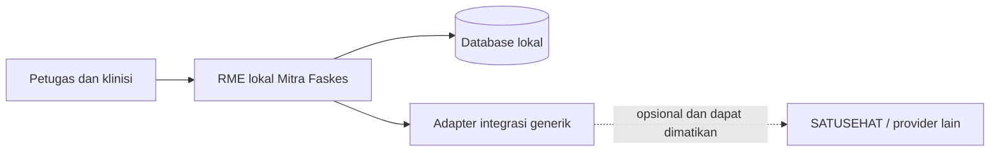

# Blueprint RME Rawat Jalan

Status: **draft untuk review produk, klinis, rekam medis, dan akreditasi**  
Baseline: 12 Agustus 2026  
Ruang lingkup: pendaftaran sampai kunjungan selesai untuk rawat jalan FKTP,
termasuk profil konsultasi umum dan gigi

## Keputusan utama

Mitra Faskes adalah RME lokal yang dapat beroperasi penuh tanpa SATUSEHAT.
Dokumentasi SATUSEHAT dipakai sebagai:

- acuan kelengkapan konteks klinis;
- acuan terminologi dan interoperabilitas;
- kontrak pemetaan saat plugin integrasi diaktifkan; dan
- daftar pemeriksaan agar data lokal kelak dapat dipertukarkan.

Dokumentasi SATUSEHAT **bukan** schema database, mesin workflow, atau tempat
penyimpanan utama aplikasi. Resource FHIR adalah representasi pertukaran data
yang dibentuk adapter dari model domain lokal.

Blueprint memakai tiga lapisan keputusan yang tidak boleh dicampur:

1. **RME lokal** untuk pelayanan sehari-hari dan sumber kebenaran klinis;
2. **regulasi serta akreditasi** untuk tata kelola dan bukti penerapan; dan
3. **SATUSEHAT** untuk terminologi serta pertukaran data saat integrasi aktif.

Perangkat lunak dapat menyediakan kontrol dan bukti yang dibutuhkan survei,
tetapi tidak dapat menjamin predikat akreditasi **Paripurna**. Predikat tersebut
ditetapkan dari penerapan nyata, dokumen, wawancara, observasi, dan hasil survei
fasilitas kesehatan.

## Hierarki sumber keputusan

Jika dua sumber memberi petunjuk berbeda, gunakan urutan berikut:

1. kebutuhan pelayanan dan keselamatan pasien;
2. aturan produk serta domain lokal Mitra Faskes;
3. peraturan RME yang berlaku;
4. panduan implementasi SATUSEHAT dan terminologi nasional;
5. contoh payload Postman sebagai contoh teknis, bukan model database.

Referensi resmi yang dipakai:

- [Playbook RME Rawat Jalan](https://satusehat.kemkes.go.id/platform/docs/id/interoperability/rme-rawat-jalan/)
- [Playbook Rawat Jalan Gigi](https://satusehat.kemkes.go.id/platform/docs/id/interoperability/rawat-jalan-gigi/)
- [Terminologi SATUSEHAT](https://satusehat.kemkes.go.id/platform/docs/id/terminology/)
- [Resource Encounter](https://satusehat.kemkes.go.id/platform/docs/id/fhir/resources/encounter/)
- [API Encounter](https://satusehat.kemkes.go.id/platform/docs/id/api-catalogue/integrations/apis/encounter/)
- [Workspace publik SATUSEHAT di Postman](https://www.postman.com/satusehat/satusehat-public/overview)
- [Permenkes 24 Tahun 2022 tentang Rekam Medis](https://jdih.kemkes.go.id/documents/peraturan-menteri-kesehatan-nomor-24-tahun-2022)
- [Permenkes 34 Tahun 2022 tentang Akreditasi](https://jdih.kemkes.go.id/documents/peraturan-menteri-kesehatan-nomor-34-tahun-2022)
- [Standar dan Instrumen Akreditasi Klinik](https://repository.kemkes.go.id/book/860)
- [Permenkes 11 Tahun 2025 tentang standar perizinan berbasis risiko sektor kesehatan](https://jdih.kemkes.go.id/documents/peraturan-menteri-kesehatan-nomor-11-tahun-2025)

Versi dokumentasi/terminologi perlu dicatat pada setiap keputusan mapping.
Contoh payload resmi dapat berubah tanpa harus memaksa migrasi schema lokal.

## Isi blueprint

| Dokumen | Fungsi |
| --- | --- |
| [Alur pasien](./patient-journey.md) | Journey pendaftaran, antrean, konsultasi, finalisasi, dan kondisi gagal |
| [Model domain](./domain-model.md) | Aggregate, lifecycle, kepemilikan data, dan perbandingan codebase saat ini |
| [Kamus data klinis](./clinical-data-dictionary.md) | Kelompok data, tingkat wajib, terminologi, dan tujuan pemetaan |
| [Konsultasi gigi dan odontogram](./dental-consultation.md) | Model longitudinal odontogram, data klinis gigi, UX, validasi, dan mapping |
| [Akreditasi dan kepatuhan RME digital](./accreditation-compliance.md) | Baseline regulasi, matriks kemampuan, bukti survei, dan version watch |
| [Pemetaan SATUSEHAT](./satusehat-resource-mapping.md) | Dependency, urutan resource, operasi remote, linkage, dan skenario uji |
| [Spesifikasi Penpot](./penpot-blueprint.md) | Struktur file, frame, komponen, state, dan aturan handoff desain |
| [Roadmap implementasi](./implementation-roadmap.md) | Tahapan delivery dan hubungan dengan issue Linear yang sudah ada |
| [Papan SVG untuk Penpot](./penpot/rme-rawat-jalan-blueprint.svg) | Visual journey dan wireframe awal yang dapat diimpor |
| [Ekstensi SVG gigi dan akreditasi](./penpot/rme-gigi-akreditasi-extension.svg) | Wireframe odontogram dan pusat bukti akreditasi |

## Definisi “RME lengkap” dalam blueprint ini

“Lengkap” tidak berarti semua resource SATUSEHAT harus menjadi menu atau tabel
tersendiri. RME dianggap lengkap bila:

- satu kunjungan memiliki konteks pasien, faskes, unit layanan, tenaga kesehatan,
  waktu, dan status yang dapat diaudit;
- data klinis inti dapat dicatat secara terstruktur dan tetap menyediakan narasi;
- draft aman disimpan, lalu finalisasi dilakukan secara eksplisit dan atomik;
- perubahan setelah final tidak menghapus riwayat;
- kode lokal dan terminologi nasional dapat hidup berdampingan;
- kegagalan integrasi tidak menghilangkan atau mengunci data lokal; dan
- modul lanjutan dapat ditambahkan tanpa mengubah aggregate inti secara radikal.

### Cakupan inti rawat jalan

Pendaftaran pasien, Encounter, anamnesis, alergi, tanda vital, pemeriksaan fisik,
diagnosis, tindakan, resep, rencana tindak lanjut/disposisi, finalisasi RME, serta
ringkasan kunjungan.

### Profil layanan gigi

Konsultasi dokter gigi memakai lifecycle Encounter dan RME yang sama, lalu
menambahkan anamnesis gigi, pemeriksaan ekstra/intraoral, odontogram permanen
dan sulung, temuan gigi serta permukaan, indeks kesehatan gigi-mulut, diagnosis,
tindakan/material, pencitraan bila ada, dan riwayat longitudinal. Odontogram
bukan gambar bebas atau satu blob yang ditimpa setiap kunjungan; temuan final
disimpan terstruktur dan historis.

### Cakupan lanjutan

Order dan hasil laboratorium/radiologi, farmasi dispense/administration, rujukan,
CarePlan, asesmen khusus, imunisasi, dan use case klinis lain. Modul ini mengikuti
aggregate inti dan ditambahkan berdasarkan jenis layanan, bukan dipaksakan ke
setiap kunjungan.

## Gate implementasi aktif

Urutan resource integrasi yang tidak boleh dilompati adalah:

`Organization -> Location -> Practitioner -> Patient -> Encounter -> Condition -> Observation`

Empat resource pertama sudah mempunyai jalur integrasi. Pekerjaan berikutnya
adalah menyelesaikan **Encounter** dari preview menjadi create/update yang benar,
baru dilanjutkan ke Condition dan Observation. Resource lain tetap tercantum
sebagai rancangan target, bukan status implementasi.

## Baseline codebase saat blueprint dibuat

- Encounter lokal dan lifecycle antrean sudah tersedia.
- Adapter Encounter baru menyediakan preview; remote create/update belum aktif.
- `MedicalRecord` masih disimpan sekaligus dan menyelesaikan Encounter; belum
  memiliki status `DRAFT`/`FINAL`.
- vital sign masih berupa kolom pada `MedicalRecord`, diagnosis masih minimal,
  dan resep masih dominan berupa string.
- form RME masih berisi nilai contoh yang terlihat seperti data klinis nyata.
- antrean masih dapat menandai kunjungan selesai tanpa gate finalisasi RME.
- outbox klinis, Condition, Observation, dan Composition belum aktif.
- belum ada entitas, route, form, ataupun visual odontogram; dukungan gigi saat
  ini baru tampak pada master diagnosis ICD-10 dan penyebutan Poli Gigi.

Daftar tersebut adalah gap yang disengaja untuk roadmap, bukan klaim bahwa
fitur tersebut telah selesai.

## Batasan

Blueprint ini tidak menggantikan validasi dokter, dokter gigi, petugas rekam
medis, tenaga farmasi, petugas privasi, pendamping akreditasi, surveyor, atau
penasihat regulasi. Sebelum rilis produksi, kamus data dan workflow final wajib
ditinjau oleh perwakilan klinis dan faskes. Status regulasi dan instrumen juga
wajib diperiksa kembali menjelang survei karena dapat berubah setelah baseline.
