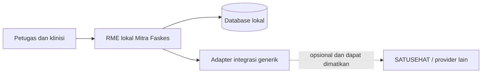

# Blueprint RME Rawat Jalan

Status: **draft untuk review produk, klinis, rekam medis, dan akreditasi**  
Baseline sumber: 12 Agustus 2026; snapshot codebase: 15 Agustus 2026; bukti
sandbox manual terakhir: 13 Agustus 2026
Ruang lingkup: pendaftaran sampai kunjungan selesai untuk rawat jalan FKTP,
termasuk profil konsultasi umum dan gigi

## Keputusan utama

Mitra Faskes adalah RME lokal yang dapat beroperasi penuh tanpa SATUSEHAT.
Dokumentasi SATUSEHAT dipakai sebagai:

- acuan kelengkapan konteks klinis;
- acuan terminologi dan interoperabilitas;
- kontrak pemetaan saat plugin integrasi diaktifkan; dan
- daftar pemeriksaan agar data lokal kelak dapat dipertukarkan.

Dokumentasi SATUSEHAT **bukan** schema database, mesin workflow, atau tempat
penyimpanan utama aplikasi. Resource FHIR adalah representasi pertukaran data
yang dibentuk adapter dari model domain lokal.

Blueprint memakai tiga lapisan keputusan yang tidak boleh dicampur:

1. **RME lokal** untuk pelayanan sehari-hari dan sumber kebenaran klinis;
2. **regulasi serta akreditasi** untuk tata kelola dan bukti penerapan; dan
3. **SATUSEHAT** untuk terminologi serta pertukaran data saat integrasi aktif.

Perangkat lunak dapat menyediakan kontrol dan bukti yang dibutuhkan survei,
tetapi tidak dapat menjamin predikat akreditasi **Paripurna**. Predikat tersebut
ditetapkan dari penerapan nyata, dokumen, wawancara, observasi, dan hasil survei
fasilitas kesehatan.

## Hierarki sumber keputusan

Jika dua sumber memberi petunjuk berbeda, gunakan urutan berikut:

1. kebutuhan pelayanan dan keselamatan pasien;
2. aturan produk serta domain lokal Mitra Faskes;
3. peraturan RME yang berlaku;
4. panduan implementasi SATUSEHAT dan terminologi nasional;
5. contoh payload Postman sebagai contoh teknis, bukan model database.

Referensi resmi yang dipakai:

- [Playbook RME Rawat Jalan](https://satusehat.kemkes.go.id/platform/docs/id/interoperability/rme-rawat-jalan/)
- [Playbook Rawat Jalan Gigi](https://satusehat.kemkes.go.id/platform/docs/id/interoperability/rawat-jalan-gigi/)
- [Terminologi SATUSEHAT](https://satusehat.kemkes.go.id/platform/docs/id/terminology/)
- [Resource Encounter](https://satusehat.kemkes.go.id/platform/docs/id/fhir/resources/encounter/)
- [API Encounter](https://satusehat.kemkes.go.id/platform/docs/id/api-catalogue/integrations/apis/encounter/)
- [Workspace publik SATUSEHAT di Postman](https://www.postman.com/satusehat/satusehat-public/overview)
- [Permenkes 24 Tahun 2022 tentang Rekam Medis](https://jdih.kemkes.go.id/documents/peraturan-menteri-kesehatan-nomor-24-tahun-2022)
- [Permenkes 34 Tahun 2022 tentang Akreditasi](https://jdih.kemkes.go.id/documents/peraturan-menteri-kesehatan-nomor-34-tahun-2022)
- [Standar dan Instrumen Akreditasi Klinik](https://repository.kemkes.go.id/book/860)
- [Permenkes 11 Tahun 2025 tentang standar perizinan berbasis risiko sektor kesehatan](https://jdih.kemkes.go.id/documents/peraturan-menteri-kesehatan-nomor-11-tahun-2025)

Versi dokumentasi/terminologi perlu dicatat pada setiap keputusan mapping.
Contoh payload resmi dapat berubah tanpa harus memaksa migrasi schema lokal.

## Isi blueprint

| Dokumen | Fungsi |
| --- | --- |
| [Alur pasien](./patient-journey.md) | Journey pendaftaran, antrean, konsultasi, finalisasi, dan kondisi gagal |
| [Model domain](./domain-model.md) | Aggregate, lifecycle, kepemilikan data, dan perbandingan codebase saat ini |
| [Kamus data klinis](./clinical-data-dictionary.md) | Kelompok data, tingkat wajib, terminologi, dan tujuan pemetaan |
| [Konsultasi gigi dan odontogram](./dental-consultation.md) | Model longitudinal odontogram, data klinis gigi, UX, validasi, dan mapping |
| [Akreditasi dan kepatuhan RME digital](./accreditation-compliance.md) | Baseline regulasi, matriks kemampuan, bukti survei, dan version watch |
| [Pemetaan SATUSEHAT](./satusehat-resource-mapping.md) | Dependency, urutan resource, operasi remote, linkage, dan skenario uji |
| [Spesifikasi Penpot](./penpot-blueprint.md) | Struktur file, frame, komponen, state, dan aturan handoff desain |
| [Roadmap implementasi](./implementation-roadmap.md) | Tahapan delivery dan hubungan dengan issue Linear yang sudah ada |
| [Papan SVG untuk Penpot](./penpot/rme-rawat-jalan-blueprint.svg) | Visual journey dan wireframe awal yang dapat diimpor |
| [Ekstensi SVG gigi dan akreditasi](./penpot/rme-gigi-akreditasi-extension.svg) | Wireframe odontogram dan pusat bukti akreditasi |

## Definisi “RME lengkap” dalam blueprint ini

“Lengkap” tidak berarti semua resource SATUSEHAT harus menjadi menu atau tabel
tersendiri. RME dianggap lengkap bila:

- satu kunjungan memiliki konteks pasien, faskes, unit layanan, tenaga kesehatan,
  waktu, dan status yang dapat diaudit;
- data klinis inti dapat dicatat secara terstruktur dan tetap menyediakan narasi;
- draft aman disimpan, lalu finalisasi dilakukan secara eksplisit dan atomik;
- perubahan setelah final tidak menghapus riwayat;
- kode lokal dan terminologi nasional dapat hidup berdampingan;
- kegagalan integrasi tidak menghilangkan atau mengunci data lokal; dan
- modul lanjutan dapat ditambahkan tanpa mengubah aggregate inti secara radikal.

### Cakupan inti rawat jalan

Pendaftaran pasien, Encounter, anamnesis, alergi, tanda vital, pemeriksaan fisik,
diagnosis, tindakan, resep, rencana tindak lanjut/disposisi, finalisasi RME, serta
ringkasan kunjungan.

### Profil layanan gigi

Konsultasi dokter gigi memakai lifecycle Encounter dan RME yang sama, lalu
menambahkan anamnesis gigi, pemeriksaan ekstra/intraoral, odontogram permanen
dan sulung, temuan gigi serta permukaan, indeks kesehatan gigi-mulut, diagnosis,
tindakan/material, pencitraan bila ada, dan riwayat longitudinal. Odontogram
bukan gambar bebas atau satu blob yang ditimpa setiap kunjungan; temuan final
disimpan terstruktur dan historis.

### Cakupan lanjutan

Order dan hasil laboratorium/radiologi, farmasi dispense/administration, rujukan,
CarePlan, asesmen khusus, imunisasi, dan use case klinis lain. Modul ini mengikuti
aggregate inti dan ditambahkan berdasarkan jenis layanan, bukan dipaksakan ke
setiap kunjungan.

## Kontrak MVP `OUTPATIENT_GENERAL_V1`

Kontrak ini adalah batas acceptance untuk satu kunjungan rawat jalan umum:
pendaftaran, Encounter, konsultasi dokter, simpan draft RME, lalu finalisasi.
Kontrak ini mengkodifikasi perilaku preflight dan form yang sudah ada pada
snapshot codebase; kontrak ini tidak menambah schema, resource, atau kebijakan
klinis baru. Rincian field-level dan pemetaan model/form ada di
[kamus data klinis](./clinical-data-dictionary.md).

### Batas alur pendaftaran dan Encounter

- Pendaftaran menerima `patientId`, `locationId`, dan `doctorId` dari form yang
  sudah ada. Organization diturunkan dari Location; nomor Encounter, nomor
  antrean, tanggal antrean, waktu tiba, status awal `WAITING`, dan status history
  dibuat server-side.
- Dokter aktif harus ter-assign ke Organization dan Location tersebut. Hanya
  Encounter `IN_PROGRESS` yang dapat memiliki draft klinis aktif dan difinalisasi.
- Workspace RME menampilkan identitas pasien, nomor Encounter, Location, dokter,
  profil layanan, dan validation profile; konteks ini bukan diisi ulang sebagai
  field klinis.

### Kelompok field kontrak

**Wajib untuk finalisasi**

- konteks sistem: Patient, Organization, Location, dokter, Encounter berstatus
  `IN_PROGRESS`, `OUTPATIENT_GENERAL`, `OUTPATIENT_GENERAL_V1`, actor yang berizin,
  dan versi yang cocok;
- `chiefComplaint` dan `presentIllness`;
- `allergyReviewStatus` yang dipilih eksplisit; `allergyDetails` wajib bila
  statusnya `KNOWN`, sedangkan `NOT_REVIEWED` memblokir finalisasi;
- `systolic`, `diastolic`, `heartRate`, `temperature`, dan `physicalExam`;
- tepat satu diagnosis utama dengan kode ICD-10; setiap diagnosis tambahan yang
  dimasukkan juga harus memiliki kode;
- `education`, `carePlan`, dan `disposition`;
- bila ada baris resep, `medicineName`, `dosage`, `frequency`, dan `quantity`
  pada baris tersebut.

**Opsional**

Riwayat klinis terstruktur, berat badan, tinggi badan, laju napas, saturasi
oksigen, diagnosis sekunder, dan resep sebagai satu kelompok. Kode KFA serta
instruksi resep boleh diisi tetapi belum menjadi syarat profile. Kunjungan tanpa
resep tetap dapat difinalisasi.

**Ditunda ke fase berikutnya**

`AllergyRecord` terstruktur, pemeriksaan fisik per sistem/body site, `Procedure`,
`MedicationOrder` terstruktur, tanggal kontrol/rujukan sebagai child plan,
Composition/outbox klinis, amendemen setelah final, profil gigi/odontogram, dan
evidence center akreditasi. Data tersebut tidak boleh menjadi syarat finalisasi
MVP melalui asumsi atau placeholder.

Keputusan klinis yang masih terbuka—terutama apakah empat vital inti berlaku
untuk semua usia/jenis kunjungan, arti “tidak dilakukan” versus “tidak diketahui”,
dan tingkat struktur minimum untuk edukasi, rencana, serta disposisi—dicatat
sebagai decision gate di bawah, bukan dianggap sebagai kebijakan klinis final.

## Gate implementasi aktif

Urutan resource integrasi yang tidak boleh dilompati adalah:

`Organization -> Location -> Practitioner -> Patient -> Encounter -> Condition -> Observation`

Tujuh resource pada urutan tersebut sekarang sudah mempunyai adapter API/plugin
dan kontrak test untuk preview, dependency, serta create/update sesuai resource
masing-masing. Encounter mempunyai jalur sync dari pendaftaran, sedangkan
Condition dan Observation dapat disinkronkan melalui workspace RME. Resource
lain tetap tercantum sebagai rancangan target, bukan status implementasi.

## Baseline codebase dan pembaruan implementasi

- Encounter lokal dan lifecycle antrean sudah tersedia.
- Adapter Encounter sekarang menyediakan preview, create/update, linkage, log,
  dan repeat sync dengan remote ID yang sama.
- `MedicalRecord` memiliki lifecycle `DRAFT`/`FINAL`, versioning, preflight,
  dan finalisasi atomik; record final menjadi read-only.
- vital sign dapat disimpan sebagai child Observation typed, diagnosis memiliki
  child ID stabil dan adapter Condition, sedangkan resep masih dominan berupa
  string.
- form RME dimulai tanpa nilai klinis contoh dan menyediakan sync per diagnosis
  serta per Observation.
- antrean dan finalisasi memakai gate lifecycle sehingga penyelesaian Encounter
  mengikuti finalisasi RME.
- Condition dan Observation sudah aktif pada API/plugin, linkage, sync log,
  dependency preflight, dan UI RME; Composition, outbox klinis, dan profil gigi
  belum aktif.
- belum ada entitas, route, form, ataupun visual odontogram; dukungan gigi saat
  ini baru tampak pada master diagnosis ICD-10 dan penyebutan Poli Gigi.

Daftar tersebut membedakan fitur yang sudah tersedia dari gap roadmap. Status
adapter yang aktif tetap belum menjadi klaim bahwa sandbox SATUSEHAT, validasi
klinis, atau kesiapan produksi telah selesai.

## Status blueprint inti pada snapshot codebase

Status berikut dipakai sebagai sumber navigasi dokumen, bukan sebagai klaim
akreditasi atau kesiapan produksi:

| Area | Status snapshot 15 Agustus 2026 | Gate berikutnya |
| --- | --- | --- |
| Encounter dan antrean | Lifecycle lokal, status history, optimistic concurrency, dan guard finalisasi tersedia | Review klinis untuk reason/disposition dan rerun sandbox Encounter bila diperlukan |
| RME lokal | `DRAFT`/`FINAL`, versioning, preflight, finalisasi atomik, audit event, dan idempotency tersedia | Amendment setelah final, outbox klinis, serta acceptance manual lengkap |
| Riwayat dan Observation | `ClinicalHistoryEntry` dan typed `ClinicalObservation` tersedia secara local-first | Review terminologi aktif dan rerun sandbox Condition/Observation |
| Diagnosis dan integrasi | Diagnosis memiliki stable local ID dan adapter Condition; adapter Observation tersedia | Lengkapi terminology profile dan bukti remote create/update |
| Resep dan tindak lanjut | Masih berupa model sederhana/string | Review farmasi sebelum MedicationOrder, dispense, rujukan, dan CarePlan |
| Profil gigi | Target blueprint; belum ada entity, route, form, atau visual odontogram | Review dokter gigi sebelum dipetakan menjadi issue implementasi |
| Akreditasi/evidence | Target governance; belum ada evidence center | Tetapkan facility type, owner, versi standar, dan scope produk |

## Keputusan yang masih perlu disahkan

Blueprint inti dapat dianggap siap menjadi acceptance source setelah keputusan
berikut memiliki owner dan hasil review tertulis:

| Keputusan | Owner review | Batas keputusan |
| --- | --- | --- |
| Field wajib `OUTPATIENT_GENERAL_V1` per usia/jenis layanan | Dokter + rekam medis | Snapshot MVP mewajibkan empat vital inti untuk profile ini; pengecualian usia/layanan harus diputuskan sebelum profile diubah. Tidak ada auto-fill klinis. |
| Semantik alergi, “tidak dilakukan”, dan “tidak diketahui” | Dokter + keselamatan pasien | Status review harus eksplisit dan tidak disimpulkan dari field kosong |
| Tingkat struktur edukasi, rencana, dan disposisi | Dokter + rekam medis | Snapshot MVP menerima narasi/enum yang sudah ada; struktur child dan reason menunggu keputusan klinis |
| Resep, identitas obat, KFA, order versus dispense | Farmasi + product | `MedicationOrder` tidak boleh disamakan dengan dispense/administration |
| Amendment, disclosure, retention, dan audit akses | Rekam medis + privasi | Koreksi final tidak menghapus histori dan setiap disclosure dapat ditelusuri |
| Gate sandbox Encounter/Condition/Observation | Integration owner | Codebase aktif tidak dianggap remote verified sebelum create/update diuji |
| Scope profil gigi dan evidence akreditasi | Dokter gigi + PMKP/product | Dipisahkan dari core sampai facility type dan reviewer disepakati |

## Batasan

Blueprint ini tidak menggantikan validasi dokter, dokter gigi, petugas rekam
medis, tenaga farmasi, petugas privasi, pendamping akreditasi, surveyor, atau
penasihat regulasi. Sebelum rilis produksi, kamus data dan workflow final wajib
ditinjau oleh perwakilan klinis dan faskes. Status regulasi dan instrumen juga
wajib diperiksa kembali menjelang survei karena dapat berubah setelah baseline.
