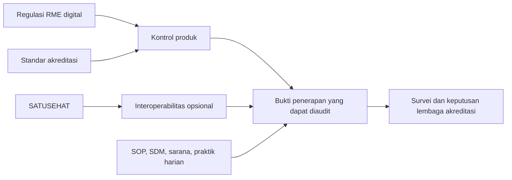

# Akreditasi Faskes dan Kepatuhan RME Digital

Status: **baseline produk; bukan opini hukum atau hasil survei**  
Baseline sumber: 12 Agustus 2026  
Snapshot codebase: 15 Agustus 2026
Fokus awal: Klinik Pratama/Utama rawat jalan

## Keputusan utama

Akreditasi menjadi panduan kedua setelah kebutuhan klinis dan regulasi RME,
sedangkan SATUSEHAT tetap menjadi panduan interoperabilitas. Produk harus dapat
menunjukkan bukan hanya “field tersedia”, tetapi juga siapa mengisi, kapan,
perubahan apa yang terjadi, kebijakan apa yang berlaku, dan bukti tindak lanjut.

Mitra Faskes dapat membantu **kesiapan bukti**, tetapi tidak boleh menampilkan
badge “Paripurna”, menjanjikan kelulusan, atau menghitung hasil resmi hanya dari
fitur aplikasi. Banyak elemen penilaian bergantung pada praktik, fasilitas,
kompetensi, wawancara, observasi, dan dokumen di luar RME.

## Baseline sumber resmi

| Sumber | Status/peran pada baseline | Dampak produk |
| --- | --- | --- |
| [Permenkes 24 Tahun 2022 tentang Rekam Medis](https://jdih.kemkes.go.id/documents/peraturan-menteri-kesehatan-nomor-24-tahun-2022) | Berstatus berlaku di JDIH | Kewajiban RME, interoperabilitas, mutu, keamanan, akses, koreksi, kerahasiaan, penyimpanan |
| [Permenkes 34 Tahun 2022 tentang Akreditasi](https://jdih.kemkes.go.id/documents/peraturan-menteri-kesehatan-nomor-34-tahun-2022) | Berstatus berlaku di JDIH | Akreditasi wajib, persiapan, survei ulang, program perbaikan pascaakreditasi |
| [KMK HK.01.07/MENKES/1983/2022 dan Instrumen Klinik 2023](https://repository.kemkes.go.id/book/860) | Baseline standar/instrumen klinik resmi yang ditemukan | 3 bab, 22 standar, 104 elemen penilaian; termasuk PKP 12 Rekam Medis |
| [Petunjuk Teknis Survei Akreditasi 2022](https://keslan.kemkes.go.id/unduhan/fileunduhan_1672286537_68043.pdf) | Acuan teknis survei dan ambang status; verifikasi lagi sebelum survei | Klinik Paripurna mensyaratkan TKK, PMKP, dan PKP masing-masing minimal 80% |
| [Permenkes 11 Tahun 2025](https://jdih.kemkes.go.id/documents/peraturan-menteri-kesehatan-nomor-11-tahun-2025) | Berstatus berlaku; standar perizinan berbasis risiko terbaru yang ditemukan | Pada ketentuan Klinik Pratama, kewajiban mencakup mutu/keselamatan, akreditasi, RME terintegrasi SIKN/SATUSEHAT, dan pembaruan data |
| [KMK HK.01.07/MENKES/321/2026](https://jdih.kemkes.go.id/documents/keputusan-menteri-kesehatan-nomor-hk0107menkes3212026) | Penetapan lembaga penyelenggara akreditasi terbaru pada baseline | Version watch administratif; bukan schema atau checklist fitur RME |

Standar dan petunjuk survei dapat direvisi. Sebelum self-assessment resmi atau
survei, pemilik faskes wajib mengonfirmasi instrumen aktif kepada Kementerian
Kesehatan dan lembaga penyelenggara akreditasi yang dipilih.

## Batas jenis fasilitas

| Jenis fasilitas | Penggunaan blueprint |
| --- | --- |
| Klinik Pratama/Utama | Gunakan matriks TKK, PMKP, PKP dan istilah status Paripurna sesuai instrumen klinik aktif |
| Puskesmas | Gunakan standar/instrumen Puskesmas tersendiri; jangan memakai skor klinik |
| TPMD/TPMDG | Gunakan instrumen praktik mandiri tersendiri; jangan menjanjikan kategori Paripurna klinik |
| Laboratorium/UTD/faskes lain | Gunakan standar khusus fasilitas tersebut |

Produk boleh memakai modul teknis yang sama, tetapi `facilityType`, standar,
versi instrumen, elemen penilaian, dan aturan skornya harus terpisah.

## Makna Paripurna untuk klinik

Petunjuk teknis survei 2022 membagi instrumen klinik menjadi:

- **TKK** — Tata Kelola Klinik: 4 standar, 19 elemen penilaian;
- **PMKP** — Peningkatan Mutu dan Keselamatan Pasien: 3 standar, 18 elemen;
- **PKP** — Penyelenggaraan Kesehatan Perseorangan: 15 standar, 67 elemen.

Totalnya 22 standar dan 104 elemen penilaian. Pada acuan tersebut, predikat
Paripurna mensyaratkan capaian minimal 80% pada **setiap** bab TKK, PMKP, dan PKP,
bukan sekadar nilai rata-rata total. Ini adalah aturan survei yang perlu
diverifikasi ulang terhadap instrumen aktif saat survei dilakukan.

Untuk telaah rekam medis, instrumen klinik menyebut rentang bukti 3 bulan untuk
survei akreditasi pertama dan 12 bulan untuk reakreditasi. Karena itu audit trail
dan report tidak boleh baru dibuat menjelang survei.

## Kontrol wajib RME digital

Terjemahan kebutuhan Permenkes 24/2022 ke kapabilitas produk:

| Area | Kapabilitas produk minimum | Bukti yang harus dapat ditunjukkan |
| --- | --- | --- |
| Penyelenggaraan | Identitas sistem, faskes, pengguna, lokasi penyimpanan, variable/metadata, registry version | Konfigurasi dan dokumen registrasi sistem RME/PSE yang berlaku |
| Kelengkapan klinis | Validation profile, author/performer, waktu, status draft/final, catatan kronologis dan terintegrasi | Sampel RME lengkap per PPA dan laporan ketidaklengkapan |
| Mutu RME | Sampling/review internal berkala, assignment reviewer, temuan, tindak lanjut | Jadwal audit, daftar sampel, hasil review, CAPA/tindak lanjut |
| Kerahasiaan | Role/permission berbasis tugas, break-glass terkontrol, session/security policy | Matriks akses, log akses, review akses berkala |
| Integritas | Final immutable, amendemen, alasan, approver sesuai kebijakan, signature/attestation bila dipakai | Riwayat versi dan koreksi yang tidak menghapus data lama |
| Koreksi | Workflow input/perbaikan/lihat; batas koreksi 2×24 jam dan approval setelah batas untuk data administratif sesuai aturan | Timestamp, actor, alasan, approval, before/after metadata |
| Ketersediaan | Backup offsite berkala, restore test, downtime procedure, monitoring | Log backup, hasil uji restore, insiden dan waktu pemulihan |
| Interoperabilitas | Adapter opsional, mapping/version, linkage, retry, transfer rujukan | Log pertukaran aman dan rekonsiliasi tanpa false success |
| Kerahasiaan/pengungkapan | Consent/legal basis, release request, recipient, scope, approval, disclosure log | Form/otorisasi dan jejak pelepasan informasi |
| Retensi | Retention policy sekurang-kurangnya 25 tahun sejak kunjungan terakhir, legal hold, disposal approval | Jadwal retensi dan berita acara pemusnahan bila berlaku |
| Hak pasien | Ringkasan/salinan isi sesuai kebijakan dan proses yang sah | Permintaan, verifikasi identitas, hasil penyerahan, waktu layanan |

Kepatuhan juga membutuhkan kebijakan dan operasional eksternal: sertifikasi
server/cloud bila diwajibkan, registrasi PSE/sistem, SOP backup, pengelolaan SDM,
serta pengujian pemulihan. Aplikasi hanya menyimpan bukti atau menjalankan kontrol
yang memang berada dalam batasnya.

## Matriks dukungan akreditasi klinik

| Bab/area | Kapabilitas digital yang disiapkan | Bukti di aplikasi | Bukti di luar aplikasi |
| --- | --- | --- | --- |
| TKK — organisasi dan tata kelola | Struktur faskes, role, kredensial/masa berlaku, document register, assignment penanggung jawab | Master organisasi, user-role, histori perubahan, daftar dokumen | SK, izin, SIP, ijazah, uraian tugas, wawancara |
| TKK — sarana dan risiko | Asset/risk register, inspeksi, maintenance reminder, issue follow-up | Risiko, owner, due date, status, lampiran bukti | Observasi bangunan/alat, kalibrasi, kontrak pihak ketiga |
| PMKP — program mutu | Indicator registry, numerator/denominator, period, target, validation, analysis, action plan | Dashboard tren, sumber data, rapat/review, tindak lanjut | Penetapan indikator, budaya mutu, wawancara |
| PMKP — keselamatan pasien | Incident report rahasia, grading, investigation, RCA sederhana, CAPA | Timeline insiden, reviewer, rekomendasi, penyelesaian | Implementasi lapangan dan pelaporan eksternal yang diwajibkan |
| PMKP — manajemen risiko/PPI | Risk register tahunan, mitigation, monitoring, PPI audit | Risk matrix, audit kepatuhan, evidence follow-up | Observasi kepatuhan, sarana PPI, pelatihan |
| PKP — identifikasi dan komunikasi | Minimal dua identifier, read-back/checklist, alert patient safety | Validasi identitas, communication record, audit | Observasi praktik petugas |
| PKP — hak, keluhan, persetujuan | Consent versioning, complaint/case tracking, education/recipient | Persetujuan terkait Encounter, respons keluhan, bukti edukasi | Form fisik bila dipakai, wawancara pasien |
| PKP — asesmen dan asuhan | Screening, asesmen komprehensif, CPPT, care plan, diagnosis, tindakan, evaluasi | RME kronologis lintas PPA, author/time, preflight | Kesesuaian isi dengan kondisi pasien |
| PKP — obat, tindakan, risiko tinggi | High-alert/allergy checks, correct patient/site/procedure checklist, anesthesia record | Checklist, override reason, medication/procedure history | Penyimpanan obat, labeling, observasi tindakan |
| PKP — rujukan dan tindak lanjut | Discharge summary, instruction, referral consent, network registry, status follow-up | Ringkasan, rujukan, penerima, hasil tindak lanjut | Sarana transportasi dan jejaring nyata |
| PKP 12 — rekam medis | RME sesuai regulasi, kelengkapan PPA, storage/loan/destruction policy, confidentiality | Audit kelengkapan, akses, versi, disclosure, retention | SPO, wawancara, observasi kerahasiaan |

## Modul bukti yang perlu dibangun

Modul ini tidak semuanya berada di form konsultasi:

1. `ComplianceStandard` dan `AssessmentElement` dengan versi, facility type,
   effective period, serta source URL;
2. `EvidenceItem` dengan owner, period, source record/document, reviewer, status,
   expiry, dan immutable review history;
3. `PolicyDocument`/document register dengan versi, approval, effective date,
   acknowledgement, serta review schedule;
4. `ClinicalRecordAudit` untuk sampling kelengkapan dan tindak lanjut;
5. `QualityIndicator` dan measurement period yang mempertahankan numerator,
   denominator, exclusion, source, analysis, dan action plan;
6. `PatientSafetyIncident` dan `CorrectiveAction` dengan akses sangat terbatas;
7. `RiskRegister` dan mitigation follow-up;
8. `ComplaintCase`, consent, referral network, credentialing, dan training log;
9. `DataAccessAudit`, `MedicalRecordAmendment`, `DisclosureRequest`, serta legal
   hold/retention controls;
10. export **evidence pack** berdasarkan periode tanpa menyalin data klinis lebih
    banyak dari yang diperlukan.

Evidence pack harus menunjukkan sumber, periode, owner, reviewer, dan timestamp.
Lampiran klinis perlu de-identification/redaction serta permission khusus.

## Status kesiapan codebase saat baseline

Ini bukan audit akreditasi resmi, melainkan gap teknis awal.

| Area | Status | Catatan |
| --- | --- | --- |
| Encounter dan antrean lokal | Parsial | Lifecycle, status history, optimistic concurrency, dan guard finalisasi tersedia; kontrol administratif dan bukti operasional masih perlu review |
| RME kronologis draft/final/amendemen | Parsial | `DRAFT`/`FINAL`, version, preflight, finalisasi atomik, dan audit event tersedia; amendment belum tersedia |
| Data klinis terstruktur | Parsial | History/Observation typed dan diagnosis terstruktur tersedia; allergy, procedure, resep, dan follow-up masih sederhana/target |
| Audit akses dan koreksi klinis | Parsial | Permission dan audit event RME tersedia; audit akses menyeluruh, disclosure, dan amendment workflow belum tersedia |
| Interoperabilitas | Parsial | Adapter Organization sampai Observation tersedia; Encounter pernah PASS pada run sebelumnya, Condition/Observation manual rerun terakhir masih BLOCKED |
| Audit mutu RME | Target | Belum ada sampling, review, temuan, dan CAPA khusus |
| Indikator mutu/insiden/risiko | Target | Perlu domain terpisah dengan akses dan pelaporan yang tepat |
| Evidence center akreditasi | Target | Belum ada versioned standard/evidence pack |
| Odontogram | Target | Belum ada model atau UI |

## Acceptance gate “accreditation-ready” internal

Istilah ini hanya berarti kontrol produk lolos, bukan predikat survei:

- facility type dan versi standar aktif eksplisit;
- setiap requirement mempunyai klasifikasi `SUPPORTED`, `PARTIAL`,
  `EXTERNAL_PROCESS`, atau `NOT_IMPLEMENTED` beserta owner;
- evidence tidak dapat dinyatakan lengkap tanpa source, period, dan reviewer;
- laporan menunjukkan gap, data stale, serta bukti kedaluwarsa tanpa memoles skor;
- role/permission, audit, amendment, disclosure, backup/restore evidence, dan
  retention diuji;
- satu audit rekam medis berkala dapat dilakukan end-to-end;
- satu indikator mutu dapat dihitung, dianalisis, dan ditindaklanjuti;
- satu insiden serta satu risiko dapat diproses sesuai permission;
- evidence pack dapat diekspor dan ditelusuri kembali ke sumber;
- pendamping akreditasi, klinisi, petugas rekam medis, privasi, dan pimpinan
  faskes meninjau hasil sebelum dipakai untuk survei.

## Version watch

- cek JDIH dan kanal resmi Kemenkes sedikitnya setiap kuartal dan sebelum survei;
- jangan mengubah standar lama; buat versi baru dengan effective period;
- simpan source URL, nomor/tahun, tanggal pengecekan, dan keputusan migrasi;
- jangan menyalin teks instrumen berhak cipta secara berlebihan ke aplikasi;
  simpan identifier, ringkasan kontrol, serta tautan sumber resmi;
- semua ambang/skor harus dapat dikonfigurasi per versi dan facility type.
