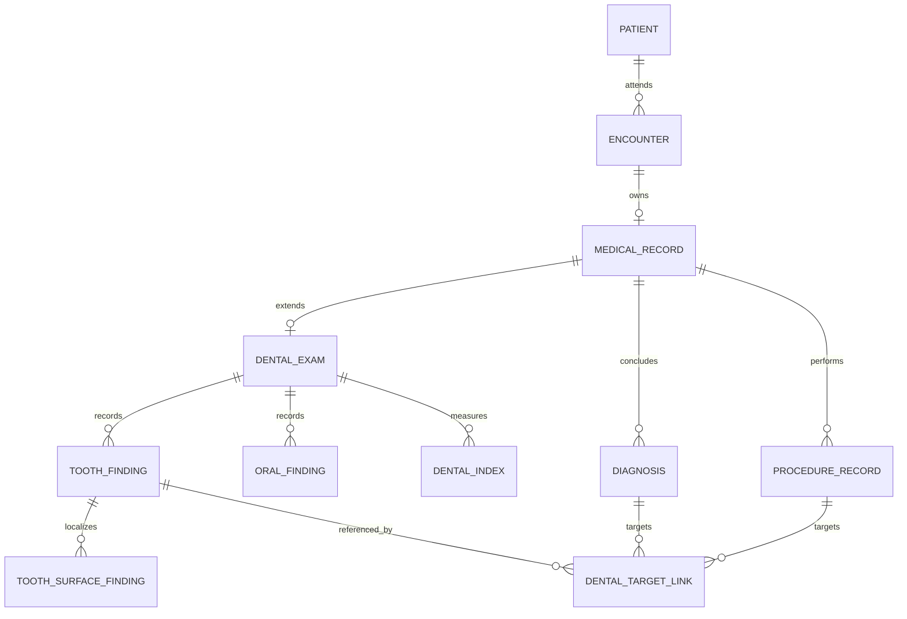

# Profil Konsultasi Gigi dan Odontogram

Status: **target blueprint; belum tersedia di codebase**  
Baseline: 12 Agustus 2026  
Acuan interoperabilitas: [Playbook Rawat Jalan Gigi SATUSEHAT](https://satusehat.kemkes.go.id/platform/docs/id/interoperability/rawat-jalan-gigi/)

## Jawaban produk

Konsultasi dokter gigi berada di dalam RME rawat jalan yang sama, bukan aplikasi
terpisah. Pengguna memilih `serviceProfile = OUTPATIENT_DENTAL`, lalu workspace
menambahkan bagian klinis gigi dan validation profile khusus.

SATUSEHAT memang menyediakan panduan layanan gigi, termasuk odontogram. Dalam
pertukaran SATUSEHAT, data odontogram direpresentasikan terutama sebagai FHIR
`Observation`; diagnosis tetap `Condition`, tindakan tetap `Procedure`, dan
pemeriksaan penunjang memakai resource sesuai maknanya. Struktur lokal tidak
perlu menyalin bentuk payload tersebut.

## Prinsip klinis dan data

1. Odontogram adalah **data klinis terstruktur**, bukan sekadar gambar, canvas,
   PDF, atau JSON tunggal.
2. Temuan final per kunjungan bersifat immutable. Tampilan “odontogram terkini”
   adalah proyeksi dari riwayat temuan final, bukan record lama yang ditimpa.
3. Gigi menggunakan nomenklatur FDI dan membedakan dentisi permanen serta sulung.
4. Kondisi gigi, permukaan, restorasi, protesa, material, diagnosis, dan tindakan
   adalah konsep terpisah walau ditampilkan dalam satu editor.
5. Riwayat sebelumnya boleh disalin sebagai **referensi draft yang terlihat**,
   tetapi tidak boleh otomatis dianggap sebagai hasil pemeriksaan hari ini.
6. Gigi yang tidak diperiksa tidak boleh otomatis ditandai sehat. Finalisasi
   menyimpan status review dan cakupan pemeriksaan secara eksplisit.
7. Warna dan simbol odontogram adalah presentasi. Kode klinis terstruktur tetap
   menjadi sumber kebenaran dan selalu mempunyai label teks.

## Alur konsultasi gigi

```mermaid
flowchart LR
    A["Mulai Encounter gigi"] --> B["Anamnesis medis dan dental"]
    B --> C["Review alergi, obat, dan faktor risiko"]
    C --> D["Pemeriksaan ekstraoral dan intraoral"]
    D --> E["Review odontogram sebelumnya"]
    E --> F["Catat temuan gigi, permukaan, dan indeks"]
    F --> G["Diagnosis serta rencana perawatan"]
    G --> H["Tindakan, material, obat, edukasi"]
    H --> I["Preflight OUTPATIENT_DENTAL_V1"]
    I --> J["Final RME dan proyeksi odontogram terkini"]
```

Riwayat odontogram tetap dapat dibuka dari profil pasien tanpa Encounter aktif,
tetapi perubahan klinis hanya dibuat dalam Encounter yang sah dan mempunyai
author, waktu, serta provenance.

## Model lokal target

`DentalChartProjection` dapat dibuat sebagai read model pasien untuk merender
kondisi terkini dan membandingkan kunjungan. Projection boleh dibangun ulang
dari record final; ia bukan sumber kebenaran yang diedit langsung.

| Entitas | Field minimum | Aturan |
| --- | --- | --- |
| `DentalExam` | medicalRecord, dentition, reviewedAt/by, coverage, note | Satu extension per RME gigi; status review eksplisit |
| `ToothFinding` | stable ID, FDI tooth, finding category/code/text, status, effectiveAt, recorder | Satu gigi dapat mempunyai beberapa temuan bermakna |
| `ToothSurfaceFinding` | tooth finding, surface code, finding/restoration reference | Dinormalisasi agar permukaan dapat dicari dan diaudit |
| `OralFinding` | site/category, code/text, laterality, note | Untuk oklusi, torus, palatum, diastema, anomali, dan temuan mulut lain |
| `DentalIndex` | type, components, score, interpretation, method, measuredAt/by | Mendukung DMF-T/dmf-t, OHI-S, DI-S, CI-S tanpa kolom khusus tak terbatas |
| `DentalTargetLink` | diagnosis/procedure, tooth finding, optional surface | Mengikat keputusan klinis ke gigi/permukaan tanpa memasukkan logika gigi ke entity generik |

Stable ID wajib tersedia sebelum adapter remote dijalankan. Temuan yang berubah
setelah final dibuat melalui amendemen; tidak ada hard delete histori klinis.

## Kamus data konsultasi gigi

### Anamnesis dan risiko

- keluhan utama dental, lokasi, onset, durasi, karakter, pemicu/pereda;
- riwayat keluhan dan perawatan gigi sebelumnya;
- riwayat medis, operasi, perdarahan, penyakit sistemik, alergi, dan obat aktif;
- kebiasaan serta faktor risiko yang relevan, termasuk merokok dan kebersihan
  mulut;
- kehamilan/laktasi dan faktor lain hanya bila relevan serta sesuai kewenangan;
- sumber informasi dan kemampuan memberikan persetujuan.

### Pemeriksaan

- keadaan umum dan tanda vital sesuai profil usia/risiko/tindakan;
- pemeriksaan ekstraoral dan intraoral;
- dentisi `PERMANENT`, `PRIMARY`, atau `MIXED`;
- FDI tooth identifier, status keberadaan/erupsi, temuan klinis, dan permukaan;
- material/restorasi/protesa bila ada;
- oklusi, torus palatinus/mandibularis, palatum, diastema, anomali gigi, dan
  kondisi rongga mulut lain;
- indeks DMF-T/dmf-t, OHI-S, debris, calculus, interpretasi, metode, pemeriksa,
  dan tanggal pemeriksaan bila dilakukan;
- foto/radiografi serta hasil penunjang sebagai reference, bukan binary di
  dalam record odontogram.

### Keputusan dan tindakan

- diagnosis utama/sekunder beserta status dan evidence;
- rencana perawatan per tahap dan prioritas;
- tindakan, gigi/permukaan target, anestesi bila digunakan, material, outcome,
  komplikasi, serta alasan bila tidak dilakukan;
- obat/resep, edukasi kebersihan mulut, instruksi pascatindakan, kontrol, dan
  rujukan.

## Validation profile `OUTPATIENT_DENTAL_V1`

Profile ini mewarisi aturan umum lalu menambahkan:

- `serviceProfile` dan dentisi dipilih secara eksplisit;
- anamnesis dental dan status review alergi terisi;
- odontogram ditandai telah direview oleh dokter gigi, beserta cakupannya;
- setiap temuan mempunyai FDI tooth, kategori, status, waktu, dan recorder;
- surface hanya boleh digunakan pada gigi dan jenis temuan yang mendukungnya;
- diagnosis/tindakan per gigi mempunyai target yang dapat ditelusuri;
- indeks hanya diwajibkan jika profile klinis/jenis kunjungan memerlukannya;
- tindakan invasif memicu rule persetujuan, checklist keselamatan, dan data
  anestesi sesuai kebijakan faskes;
- tidak ada “semua sehat” hasil auto-fill;
- finalisasi tidak menghapus temuan sebelumnya dan tidak bergantung pada sync.

## Pemetaan SATUSEHAT

| Makna lokal | Resource tujuan | Keputusan adapter |
| --- | --- | --- |
| Encounter konsultasi gigi | Encounter | Tetap mengikuti gate Encounter umum |
| Keluhan/diagnosis dental | Condition | Category dan provenance dipertahankan |
| Odontogram dan kondisi gigi | Observation | FDI tooth pada body site; komponen mengikuti profile/terminologi aktif |
| Permukaan, restorasi, protesa, material | Observation component atau resource terkait sesuai profile | Jangan membekukan code hanya dari contoh payload |
| Oklusi, torus, palatum, diastema, anomali | Observation | Satu atau beberapa resource sesuai playbook aktif |
| DMF dan indeks kebersihan mulut | Observation | Nilai, komponen, interpretasi, pemeriksa, waktu |
| Tindakan dental | Procedure | Target gigi/body site dan performer dipetakan |
| Order/radiografi/hasil | ServiceRequest, ImagingStudy, DiagnosticReport | Dibuat hanya bila kejadian nyata ada |
| Resep | Medication + MedicationRequest | Order terpisah dari dispense/administration |

Adapter menyimpan versi playbook gigi, terminology release, mapper version, dan
stable local ID pada metadata. Exact code LOINC/SNOMED/KPTL/KFA mengikuti
terminologi SATUSEHAT aktif dan harus memiliki contract test; display atau urutan
komponen pada satu contoh tidak boleh dijadikan schema lokal permanen.

## UX odontogram

- tampilkan dentisi permanen dan sulung dengan nomor FDI yang dapat dibaca;
- setiap gigi adalah control keyboard-accessible, bukan area klik tanpa label;
- pemilihan gigi membuka editor temuan dan permukaan, bukan modal bertumpuk;
- tampilkan legenda teks + simbol; warna bukan satu-satunya pembeda;
- sediakan mode visual, mode daftar, dan ringkasan cetak;
- tampilkan “sebelumnya” dan “kunjungan ini” berdampingan dengan tanggal/author;
- tandai temuan baru, berubah, terselesaikan, dan belum direview secara berbeda;
- pada layar sempit gunakan daftar per kuadran/gigi; jangan mengecilkan seluruh
  odontogram sampai target sentuh tidak dapat digunakan;
- autosave, version conflict, read-only final, dan amendemen mengikuti workspace
  RME umum.

## Skenario penerimaan manual

1. Buat Encounter dengan profil layanan gigi dan buka draft kosong.
2. Pastikan odontogram lama terlihat sebagai referensi tetapi tidak menjadi
   temuan kunjungan baru secara otomatis.
3. Catat karies pada satu gigi/permukaan, restorasi pada gigi lain, dan satu
   temuan mulut non-gigi; simpan lalu refresh.
4. Tambahkan diagnosis dan tindakan yang menargetkan gigi tersebut.
5. Uji dentisi sulung dan campuran; nomor gigi tidak boleh tertukar.
6. Finalisasi dengan odontogram belum direview harus ditolak; gigi tak diperiksa
   tidak boleh berubah menjadi sehat.
7. Finalisasi valid membentuk histori immutable dan memperbarui projection.
8. Uji keyboard, pembaca layar, tampilan daftar, print, dan layar sempit.
9. Setelah gate Encounter, Condition, dan Observation tersedia, uji satu create
   serta repeat update sandbox tanpa mengganti remote ID.

## Gap codebase saat baseline

Pencarian kode hanya menemukan master diagnosis ICD-10 terkait gigi dan
penyebutan Poli Gigi. Belum ada model `DentalExam`/`ToothFinding`, API, validation
profile, odontogram UI, projection longitudinal, atau adapter SATUSEHAT gigi.
Dokumen ini adalah spesifikasi implementasi, bukan klaim fitur sudah tersedia.
