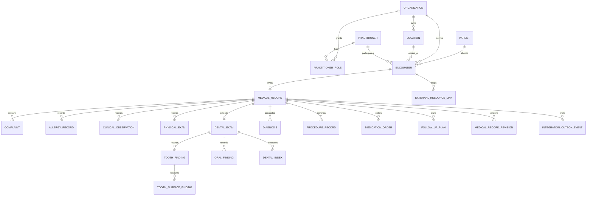
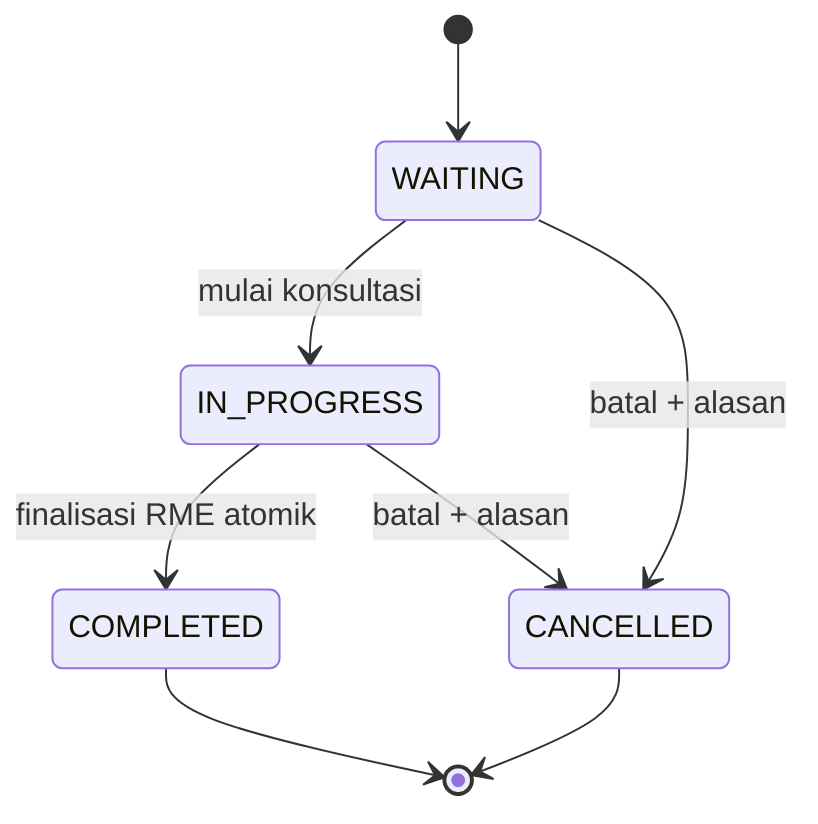
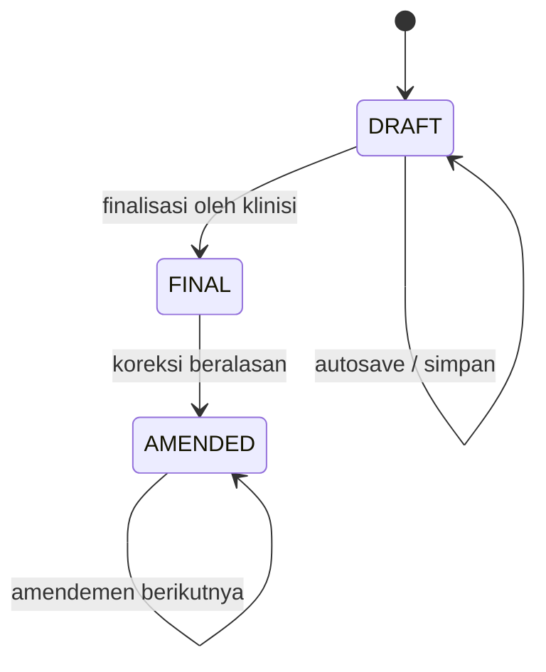

# Model Domain Target

## Batas aggregate

Model lokal dibuat berdasarkan tanggung jawab produk, bukan berdasarkan jumlah
resource FHIR.

### Aggregate `Encounter`

Menjawab “siapa datang, dilayani di mana, oleh siapa, kapan, dan bagaimana
status kunjungannya”. Aggregate ini tidak menyimpan seluruh isi pemeriksaan.

Invariant:

- satu Encounter milik satu Patient, Organization, dan Location;
- participant klinis harus valid untuk organisasi/unit yang dipilih;
- status hanya berubah lewat policy resmi dan menulis status history;
- `COMPLETED` klinis hanya terjadi bersama finalisasi RME;
- cancellation menyimpan alasan dan actor;
- perubahan menggunakan optimistic concurrency.

### Aggregate `MedicalRecord`

Menjawab “apa yang ditemukan, diputuskan, dan direncanakan selama Encounter”.
Satu Encounter mempunyai paling banyak satu RME aktif, dengan riwayat revisi.

`AMENDED` adalah lifecycle dokumen lokal, bukan status Encounter. Implementasi
awal minimal wajib mendukung `DRAFT` dan `FINAL`; amendemen dapat dirilis setelah
workflow final stabil, tetapi schema tidak boleh menutup jalannya.

Invariant:

- `encounterId` unik;
- `serviceProfile` menentukan validation profile dan section tambahan tanpa
  mengganti lifecycle dasar Encounter/RME;
- hanya actor klinis berizin yang dapat menulis/finalisasi;
- draft boleh parsial, final wajib lolos validation profile;
- author, finalizer, timestamp, dan versi ditentukan server;
- child record menyimpan kode sistem, kode, display snapshot, dan teks lokal
  ketika terminologi digunakan;
- record final immutable melalui operasi biasa;
- penghapusan child saat update draft harus menghasilkan audit yang benar dan
  tidak menghapus histori record final.

### Extension konsultasi gigi

`OUTPATIENT_DENTAL` memperluas `MedicalRecord` dengan satu `DentalExam`. Sumber
kebenaran tetap temuan per Encounter; odontogram terkini adalah projection
pasien yang dapat dibangun ulang, bukan gambar atau state tunggal yang ditimpa.

Invariant tambahan:

- dentisi permanen, sulung, dan campuran dibedakan;
- identifier gigi memakai nomenklatur FDI dan disimpan terpisah dari label UI;
- temuan gigi, permukaan, restorasi/protesa, diagnosis, serta tindakan tetap
  konsep terpisah dan dihubungkan dengan stable IDs;
- finalisasi menyimpan reviewer dan cakupan pemeriksaan; gigi yang tidak
  diperiksa tidak dianggap sehat;
- tampilan longitudinal hanya memakai record final/amendemen yang sah;
- binary radiografi/foto tidak disimpan sebagai field odontogram.

Rincian ada di [profil konsultasi gigi](./dental-consultation.md).

### Aggregate tata kelola dan akreditasi

Data seperti standar, elemen penilaian, evidence, indikator mutu, insiden,
risiko, dokumen kebijakan, dan audit kelengkapan berada pada module governance
terpisah. Module tersebut boleh mereferensikan metadata klinis sesuai izin,
tetapi tidak menjadi child `MedicalRecord` dan tidak mengubah isi final.

## Entitas target minimum

| Entitas | Field penting | Catatan |
| --- | --- | --- |
| `Encounter` | number, patient, organization, location, participants, class, reason, status, timestamps, disposition, version | Konteks/lifecycle kunjungan |
| `EncounterStatusHistory` | from/to status, at, actor, reason, version | Append-only |
| `MedicalRecord` | encounter, status, version, serviceProfile, authoredBy/At, finalizedBy/At, validationProfile | Root isi klinis |
| `Complaint` | type, code/text, onset, duration, note | Keluhan utama berbeda dari diagnosis |
| `ClinicalHistoryEntry` | category, code/text, status, onset/period, note | Riwayat sekarang/dahulu/keluarga |
| `AllergyRecord` | substance code/text, status, criticality, reaction, severity, onset, note | Tidak ditanam sebagai string bebas saja |
| `ClinicalObservation` | category, code, value typed, unit UCUM, effectiveAt, performer, interpretation | Termasuk vital signs; nilai bukan satu kolom generik |
| `PhysicalExam` | body site/system, finding code/text, laterality, note | Dapat berupa normal/abnormal + narasi |
| `DentalExam` | dentition, review status/coverage, reviewedBy/At, note | Extension hanya untuk profil gigi |
| `ToothFinding` | FDI tooth, category/code/text, status, effectiveAt, recorder | Append-only melalui final/amendemen |
| `ToothSurfaceFinding` | tooth finding, surface code, finding/restoration link | Permukaan dinormalisasi untuk query/audit |
| `OralFinding` | site/category, code/text, laterality, note | Oklusi, torus, palatum, diastema, anomali, lainnya |
| `DentalIndex` | type, components, score, interpretation, method, performer/time | DMF-T/dmf-t, OHI-S, DI-S, CI-S dan indeks terversi |
| `DentalTargetLink` | diagnosis/procedure, tooth finding, optional surface | Mengikat keputusan klinis ke target dental |
| `Diagnosis` | ICD code/display, category, rank, clinical/verification status, onset, note | Mendukung diagnosis utama dan sekunder |
| `ProcedureRecord` | code, status, performedAt/period, performer, outcome, body site, note | Hanya dibuat jika tindakan dilakukan |
| `MedicationOrder` | medication identity, dose, route, timing, duration, quantity, instruction, indication, status | KFA-ready; order bukan dispense |
| `FollowUpPlan` | disposition, control date, referral/service request, education, instruction | Menutup kunjungan secara eksplisit |
| `MedicalRecordRevision` | prior version, reason, author, at, snapshot/diff | Koreksi setelah final |
| `AuditEvent` | actor, action, entity, before/after metadata, request/correlation ID, at | Bukan isi klinis utama |

## Hubungan dengan FHIR/SATUSEHAT

| Model lokal | Representasi pertukaran yang mungkin | Keputusan |
| --- | --- | --- |
| `Encounter` | Encounter | Hubungan paling dekat, tetapi status dan rule lokal tetap milik domain |
| `Complaint` | Condition atau bagian anamnesis | Pemetaan berdasarkan makna; bukan otomatis Diagnosis |
| `ClinicalObservation` | Observation | Satu atau beberapa resource per pengukuran/panel |
| `DentalExam` dan child findings | Observation | Menghasilkan odontogram/indeks sesuai playbook gigi aktif |
| `Diagnosis` | Condition | Diagnosis utama/sekunder mempertahankan rank lokal |
| `ProcedureRecord` | Procedure | Hanya ketika tindakan memang terjadi |
| `MedicationOrder` | Medication + MedicationRequest | Identitas obat dipisah dari order pasien |
| `FollowUpPlan` | CarePlan, ServiceRequest, atau field Encounter | Adapter memilih sesuai maksud data |
| `MedicalRecord` final | Composition yang mereferensikan resource lain | Composition adalah ringkasan pertukaran, bukan tabel induk RME |

Satu entitas lokal boleh menghasilkan lebih dari satu resource; beberapa field
lokal juga boleh membentuk satu resource. Karena itu ID FHIR tidak ditempelkan
ke semua tabel domain. Hubungan eksternal dicatat secara generik lewat
`ExternalResourceLink` dengan provider, environment, resource type, local ID,
dan remote ID.

## Perbandingan codebase saat ini dan target

| Area | Saat ini | Target |
| --- | --- | --- |
| Encounter | Lifecycle lokal dan history tersedia | Tambah reason/disposition yang terstruktur dan gate finalisasi |
| RME | Upsert satu kali, lalu Encounter langsung selesai | `DRAFT` tersimpan berkali-kali; `FINAL` eksplisit dan immutable |
| Vital signs | Kolom pada `MedicalRecord` | `ClinicalObservation` typed + LOINC/UCUM, dengan read model ringkas bila perlu |
| Anamnesis | Satu teks panjang | Narasi tetap ada, bagian penting dapat terstruktur |
| Diagnosis | Code/name/primary minimal | category, rank, status, onset, terminology snapshot |
| Prescription | Nama, dosis, frekuensi string | Medication identity + dosage/timing/quantity terstruktur |
| Procedure/follow-up | Belum menjadi child entity | Entity eksplisit, hanya dibuat bila relevan |
| Konsultasi gigi/odontogram | Belum ada model atau UI | Extension dental terstruktur + projection longitudinal |
| Finalisasi | Save RME sekaligus menyelesaikan Encounter | Preflight + commit atomik + audit + outbox |
| Integrasi | Encounter preview saja | Operasi remote bertahap, linkage dan sync log yang benar |

## Boundary integrasi

- Core domain tidak mengimpor mapper/client SATUSEHAT.
- Local CRUD tidak memanggil network provider.
- Domain event/outbox membawa intent generik dan local identifiers.
- Plugin membaca snapshot lokal, memetakan resource, lalu menyimpan linkage/log.
- Aplikasi harus build, start, dan menjalankan seluruh alur lokal saat semua
  integrasi dinonaktifkan.
- Label “tersinkron” hanya berasal dari linkage persisten, bukan state dialog,
  field lokal, atau asumsi karena preview berhasil.
