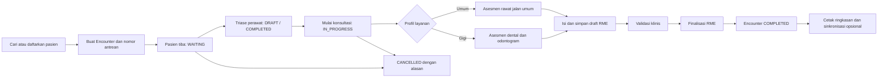

# Alur Pasien RME Rawat Jalan

## Alur utama

Satu episode rawat jalan lokal diwakili oleh satu `Encounter`. Encounter
menampung konteks kunjungan dan lifecycle; isi pemeriksaan disimpan dalam
`MedicalRecord` beserta child clinical records. Keduanya berkaitan erat, tetapi
bukan objek yang sama.

## Aktor

| Aktor | Tanggung jawab utama | Tidak boleh dilakukan |
| --- | --- | --- |
| Petugas pendaftaran | Identifikasi pasien, data demografi, membuat kunjungan dan antrean | Mengubah isi klinis final |
| Perawat klinis | Mengisi, menyimpan, dan menyelesaikan triase awal saat Encounter `WAITING`; dapat melanjutkan triase yang tertinggal saat Encounter sudah `IN_PROGRESS` | Memulai konsultasi atau memfinalisasi RME |
| Dokter/dokter gigi | Memulai konsultasi, mengisi, memvalidasi, dan memfinalisasi RME sesuai kewenangan | Menghapus jejak perubahan final |
| Admin faskes | Master data, pengguna, konfigurasi, pemantauan integrasi | Membaca/menulis isi klinis tanpa izin eksplisit |
| Sistem | Validasi, versioning, audit, transaksi atomik, antrean integrasi | Menganggap sync berhasil tanpa linkage remote |

`PERAWAT` adalah peran klinis untuk triase. Akun administrasi pendaftaran memakai
`PETUGAS_PENDAFTARAN`, sehingga perubahan peran tidak memberi akun lama akses
klinis secara diam-diam: akun `PERAWAT` yang sudah ada tetap klinis, sedangkan
akun pendaftaran baru harus memakai role khusus tersebut.

## Tahap pelayanan

| Tahap | Tindakan pengguna | Data lokal yang dihasilkan | Status | Acuan interoperabilitas |
| --- | --- | --- | --- | --- |
| 1. Identifikasi | Cari NIK/MRN, pilih atau buat pasien | `Patient` | — | FHIR Patient |
| 2. Registrasi kunjungan | Organization mengikuti penugasan akun; pilih Location dan dokter aktif pada faskes tersebut | `Encounter`, status history | `WAITING` | Encounter `arrived`, class `AMB` |
| 3. Triase awal | Perawat mengisi keluhan, riwayat penyakit sekarang, review alergi, dan empat vital inti; draft dapat disimpan berulang | `MedicalRecord`, typed `ClinicalObservation`/history | `WAITING` + triage `DRAFT` | Tidak mengirim resource remote |
| 4. Selesaikan triase | Perawat menandai triase selesai setelah data minimum terpenuhi; draft yang tertinggal saat `IN_PROGRESS` dapat dilanjutkan, sedangkan triase `COMPLETED` tidak diubah oleh perawat | triage metadata + audit | Encounter tetap pada status lifecycle saat ini + triage `COMPLETED` | Tidak mengirim resource remote |
| 5. Panggil pasien | Dokter memulai pemeriksaan; triase belum lengkap boleh dilanjutkan dengan peringatan dan tetap muncul di antrean triase perawat | waktu mulai, actor | `IN_PROGRESS` | Encounter `in-progress` |
| 6. Pilih profil | Konfirmasi `OUTPATIENT_GENERAL` dan `OUTPATIENT_GENERAL_V1` | `serviceProfile` | `DRAFT` | Tidak mengirim resource |
| 7. Asesmen | Dokter meninjau/mengoreksi triase, lalu melengkapi pemeriksaan fisik dan data klinis lain | draft `MedicalRecord` dan child records | `DRAFT` | Condition/Observation/ClinicalImpression sesuai makna |
| 8. Rencana | Wajib: satu diagnosis utama berkode, edukasi, rencana, dan disposisi. Resep serta diagnosis tambahan opsional; Procedure belum masuk MVP | diagnosis, prescription, plan | `DRAFT` | Condition; Medication/Procedure/CarePlan mengikuti fase lanjutan |
| 9. Preflight | Sistem memeriksa kontrak `OUTPATIENT_GENERAL_V1` dan konflik versi | hasil validasi | `DRAFT` | belum mengirim data |
| 10. Finalisasi | Dokter/dokter gigi menyatakan catatan selesai | author/finalizer, snapshot/version, audit | `FINAL` | resource klinis final siap dipetakan |
| 11. Tutup kunjungan | Sistem menutup dalam transaksi yang sama | end time, status history | `COMPLETED` | Encounter `finished` |
| 12. Pascalayanan | Ringkasan, resep, rujukan, integrasi | dokumen lokal, outbox/link/log opsional | tetap final | Composition dan resource terkait bila berlaku |

## Kontrak MVP pada workspace dokter

Form saat ini memulai seluruh field klinis kosong. Untuk mencapai finalisasi
`OUTPATIENT_GENERAL_V1`, dokter mengisi `chiefComplaint`, `presentIllness`,
`allergyReviewStatus` (dan detail bila `KNOWN`), `systolic`, `diastolic`,
`heartRate`, `temperature`, `physicalExam`, satu diagnosis utama ICD-10,
`education`, `carePlan`, dan `disposition`. Kunjungan tanpa resep tetap valid;
setiap baris resep yang ditambahkan harus memiliki nama obat, dosis, frekuensi,
dan jumlah positif.

Field riwayat terstruktur, berat/tinggi badan, laju napas, saturasi oksigen, dan
diagnosis sekunder dapat disimpan tetapi tidak menghalangi finalisasi. Form dan
model saat ini belum menjadi dasar untuk Procedure, AllergyRecord terstruktur,
MedicationOrder, rencana rujukan terstruktur, atau odontogram.

## Konteks yang selalu terlihat di workspace dokter

- nama, nomor rekam medis, tanggal lahir/umur, dan jenis kelamin pasien;
- penanda alergi/risiko yang diketahui;
- nomor Encounter, unit layanan, dokter, waktu tiba, dan durasi tunggu;
- profil layanan dan validation profile yang sedang dipakai;
- status draft/final dan waktu simpan terakhir;
- indikator konflik versi atau koneksi, tanpa menyamarkannya sebagai status sync;
- satu aksi utama sesuai state: `Mulai konsultasi`, `Simpan draft`, atau
  `Finalisasi RME`.

## Cabang konsultasi dokter gigi

Setelah profil gigi dipilih, workspace menambahkan:

1. anamnesis medis serta dental dan review alergi/obat;
2. pemeriksaan ekstraoral/intraoral;
3. odontogram permanen/sulung/campuran dan riwayat sebelumnya;
4. temuan per gigi/permukaan, restorasi/protesa, oral finding, dan indeks bila
   relevan;
5. diagnosis, rencana, tindakan/material, obat, edukasi, kontrol, atau rujukan.

Odontogram lama hanya menjadi referensi. Temuan kunjungan ini harus dikonfirmasi
dan diatribusikan ke pemeriksa. Preflight menolak status “belum direview”, tetapi
tidak memaksa semua gigi menjadi sehat. Lihat
[profil konsultasi gigi](./dental-consultation.md).

## Aturan finalisasi

1. Hanya Encounter `IN_PROGRESS` yang dapat mempunyai draft klinis aktif.
2. Menyimpan draft tidak mengubah Encounter menjadi `COMPLETED`.
3. Finalisasi meminta konfirmasi dan menjalankan preflight server-side.
4. Simpan data klinis final, audit, dan perubahan Encounter ke `COMPLETED`
   dilakukan dalam satu transaksi lokal.
5. Catatan `FINAL` tidak dapat diubah melalui endpoint update biasa.
6. Koreksi triase oleh dokter selama pemeriksaan mempertahankan status triase
   yang sudah selesai, memperbarui attribution terakhir, dan menulis audit
   `RME_TRIAGE_CORRECTED_BY_DOCTOR`.
7. Koreksi setelah final dibuat sebagai amendemen dengan alasan, author, waktu,
   dan hubungan ke versi sebelumnya.
8. Pengiriman SATUSEHAT terjadi setelah commit lokal melalui outbox/integration
   job; kegagalan remote tidak membatalkan finalisasi lokal.

## Alur pengecualian

### Pasien batal

- `WAITING` atau `IN_PROGRESS` dapat menuju `CANCELLED` sesuai policy.
- alasan, actor, waktu, dan versi harus tersimpan.
- draft yang sudah ada tidak boleh dihapus; tampil sebagai kunjungan batal dan
  tidak diperlakukan sebagai RME final.

### Duplikasi pasien

- jangan membuat Encounter baru sebelum operator memilih record pasien;
- kandidat duplikat ditampilkan berdasarkan NIK/MRN/demografi;
- merge pasien adalah workflow administratif terpisah dan diaudit.

### Konflik dua tab

- update draft menggunakan optimistic concurrency (`version`);
- server menolak versi lama dengan konflik yang dapat dipahami;
- UI menawarkan muat ulang atau salin perubahan pengguna, bukan overwrite diam-diam.

### Koneksi SATUSEHAT gagal

- Encounter/RME lokal tetap tersimpan dan dapat digunakan;
- percobaan gagal masuk sync log/outbox dengan pesan yang dapat ditindaklanjuti;
- status UI tetap “belum tersinkron” atau “terhubung, sync terakhir gagal” sesuai
  linkage terakhir;
- retry tidak membuat resource remote duplikat.

### Tutup kunjungan administratif

Tombol langsung `Selesai` pada antrean tidak boleh melewati finalisasi klinis.
Jika faskes membutuhkan administrative close tanpa RME, sediakan operasi khusus
dengan permission, alasan wajib, audit, dan status yang tidak disamakan dengan
RME final.

## Skenario penerimaan manual end-to-end

1. Login sebagai petugas pendaftaran.
2. Cari pasien; buat pasien baru bila tidak ditemukan.
3. Buat satu Encounter untuk Organization akun, Location, dokter, dan tanggal aktif.
4. Pastikan pasien tampil di antrean `WAITING`.
5. Login sebagai perawat klinis; pilih pasien `WAITING`, isi keluhan, riwayat
   penyakit sekarang, review alergi, dan empat vital inti.
6. Simpan draft, refresh browser, selesaikan triase, lalu pastikan Encounter
   tetap `WAITING` dengan badge triase selesai.
7. Login sebagai dokter, mulai konsultasi; status menjadi `IN_PROGRESS`.
   Pastikan dokter dapat meninjau/mengoreksi data triase dan koreksi tercatat
   atas nama dokter.
   Jika dokter memulai sebelum triase selesai, logout dan login sebagai perawat;
   pasien tetap harus muncul di antrean triase untuk dilanjutkan.
8. Lengkapi pemeriksaan fisik, satu diagnosis utama ICD-10, edukasi, rencana,
   dan disposisi. Tambahkan resep hanya bila diperlukan; bila ada, lengkapi
   nama, dosis, frekuensi, dan jumlahnya.
9. Simpan draft, refresh browser, lalu pastikan semua data kembali tanpa
   menyelesaikan Encounter.
10. Coba finalisasi dengan data wajib tidak lengkap; sistem harus menolak dengan
   pesan per bagian.
11. Lengkapi data dan finalisasi; RME menjadi `FINAL` dan Encounter `COMPLETED`
   dalam satu operasi.
12. Pastikan update normal terhadap catatan final ditolak dan audit dapat dilihat.
13. Bila plugin aktif, pastikan job integrasi mengikuti dependency dan kegagalan
   remote tidak mengubah hasil lokal.

Untuk layanan gigi, ulangi skenario dengan dentisi permanen dan sulung, temuan
per permukaan, target diagnosis/tindakan, histori odontogram, serta mode daftar
yang keyboard-accessible.
