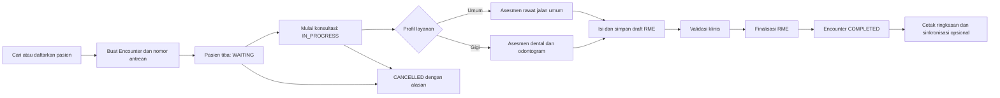

# Alur Pasien RME Rawat Jalan

## Alur utama

Satu episode rawat jalan lokal diwakili oleh satu `Encounter`. Encounter
menampung konteks kunjungan dan lifecycle; isi pemeriksaan disimpan dalam
`MedicalRecord` beserta child clinical records. Keduanya berkaitan erat, tetapi
bukan objek yang sama.

## Aktor

| Aktor | Tanggung jawab utama | Tidak boleh dilakukan |
| --- | --- | --- |
| Petugas pendaftaran | Identifikasi pasien, data demografi, membuat kunjungan dan antrean | Mengubah isi klinis final |
| Dokter/dokter gigi | Memulai konsultasi, mengisi, memvalidasi, dan memfinalisasi RME sesuai kewenangan | Menghapus jejak perubahan final |
| Admin faskes | Master data, pengguna, konfigurasi, pemantauan integrasi | Membaca/menulis isi klinis tanpa izin eksplisit |
| Sistem | Validasi, versioning, audit, transaksi atomik, antrean integrasi | Menganggap sync berhasil tanpa linkage remote |

Peran perawat klinis/triase dapat ditambahkan sebagai peran terpisah. Peran
legacy `PERAWAT` di codebase saat ini masih diperlakukan sebagai petugas
pendaftaran, sehingga tidak boleh diam-diam diberi akses klinis.

## Tahap pelayanan

| Tahap | Tindakan pengguna | Data lokal yang dihasilkan | Status | Acuan interoperabilitas |
| --- | --- | --- | --- | --- |
| 1. Identifikasi | Cari NIK/MRN, pilih atau buat pasien | `Patient` | — | FHIR Patient |
| 2. Registrasi kunjungan | Pilih tanggal, unit, dokter, nomor antrean | `Encounter`, status history | `WAITING` | Encounter `arrived`, class `AMB` |
| 3. Panggil pasien | Dokter membuka workspace konsultasi | waktu mulai, actor | `IN_PROGRESS` | Encounter `in-progress` |
| 4. Pilih profil | Konfirmasi layanan umum/gigi dan validation profile | `serviceProfile` | `DRAFT` | Tidak mengirim resource |
| 5. Asesmen | Keluhan, riwayat, alergi, tanda vital, pemeriksaan; profil gigi menambah odontogram | draft `MedicalRecord` dan child records | `DRAFT` | Condition/Observation/ClinicalImpression sesuai makna |
| 6. Rencana | Diagnosis, tindakan, obat, edukasi, tindak lanjut | diagnosis, procedure, medication order, plan | `DRAFT` | Condition/Procedure/MedicationRequest/CarePlan |
| 7. Preflight | Sistem memeriksa data wajib profile dan konflik versi | hasil validasi | `DRAFT` | belum mengirim data |
| 8. Finalisasi | Dokter/dokter gigi menyatakan catatan selesai | author/finalizer, snapshot/version, audit | `FINAL` | resource klinis final siap dipetakan |
| 9. Tutup kunjungan | Sistem menutup dalam transaksi yang sama | end time, status history | `COMPLETED` | Encounter `finished` |
| 10. Pascalayanan | Ringkasan, resep, rujukan, integrasi | dokumen lokal, outbox/link/log opsional | tetap final | Composition dan resource terkait bila berlaku |

## Konteks yang selalu terlihat di workspace dokter

- nama, nomor rekam medis, tanggal lahir/umur, dan jenis kelamin pasien;
- penanda alergi/risiko yang diketahui;
- nomor Encounter, unit layanan, dokter, waktu tiba, dan durasi tunggu;
- profil layanan dan validation profile yang sedang dipakai;
- status draft/final dan waktu simpan terakhir;
- indikator konflik versi atau koneksi, tanpa menyamarkannya sebagai status sync;
- satu aksi utama sesuai state: `Mulai konsultasi`, `Simpan draft`, atau
  `Finalisasi RME`.

## Cabang konsultasi dokter gigi

Setelah profil gigi dipilih, workspace menambahkan:

1. anamnesis medis serta dental dan review alergi/obat;
2. pemeriksaan ekstraoral/intraoral;
3. odontogram permanen/sulung/campuran dan riwayat sebelumnya;
4. temuan per gigi/permukaan, restorasi/protesa, oral finding, dan indeks bila
   relevan;
5. diagnosis, rencana, tindakan/material, obat, edukasi, kontrol, atau rujukan.

Odontogram lama hanya menjadi referensi. Temuan kunjungan ini harus dikonfirmasi
dan diatribusikan ke pemeriksa. Preflight menolak status “belum direview”, tetapi
tidak memaksa semua gigi menjadi sehat. Lihat
[profil konsultasi gigi](./dental-consultation.md).

## Aturan finalisasi

1. Hanya Encounter `IN_PROGRESS` yang dapat mempunyai draft klinis aktif.
2. Menyimpan draft tidak mengubah Encounter menjadi `COMPLETED`.
3. Finalisasi meminta konfirmasi dan menjalankan preflight server-side.
4. Simpan data klinis final, audit, dan perubahan Encounter ke `COMPLETED`
   dilakukan dalam satu transaksi lokal.
5. Catatan `FINAL` tidak dapat diubah melalui endpoint update biasa.
6. Koreksi setelah final dibuat sebagai amendemen dengan alasan, author, waktu,
   dan hubungan ke versi sebelumnya.
7. Pengiriman SATUSEHAT terjadi setelah commit lokal melalui outbox/integration
   job; kegagalan remote tidak membatalkan finalisasi lokal.

## Alur pengecualian

### Pasien batal

- `WAITING` atau `IN_PROGRESS` dapat menuju `CANCELLED` sesuai policy.
- alasan, actor, waktu, dan versi harus tersimpan.
- draft yang sudah ada tidak boleh dihapus; tampil sebagai kunjungan batal dan
  tidak diperlakukan sebagai RME final.

### Duplikasi pasien

- jangan membuat Encounter baru sebelum operator memilih record pasien;
- kandidat duplikat ditampilkan berdasarkan NIK/MRN/demografi;
- merge pasien adalah workflow administratif terpisah dan diaudit.

### Konflik dua tab

- update draft menggunakan optimistic concurrency (`version`);
- server menolak versi lama dengan konflik yang dapat dipahami;
- UI menawarkan muat ulang atau salin perubahan pengguna, bukan overwrite diam-diam.

### Koneksi SATUSEHAT gagal

- Encounter/RME lokal tetap tersimpan dan dapat digunakan;
- percobaan gagal masuk sync log/outbox dengan pesan yang dapat ditindaklanjuti;
- status UI tetap “belum tersinkron” atau “terhubung, sync terakhir gagal” sesuai
  linkage terakhir;
- retry tidak membuat resource remote duplikat.

### Tutup kunjungan administratif

Tombol langsung `Selesai` pada antrean tidak boleh melewati finalisasi klinis.
Jika faskes membutuhkan administrative close tanpa RME, sediakan operasi khusus
dengan permission, alasan wajib, audit, dan status yang tidak disamakan dengan
RME final.

## Skenario penerimaan manual end-to-end

1. Login sebagai petugas pendaftaran.
2. Cari pasien; buat pasien baru bila tidak ditemukan.
3. Buat satu Encounter untuk organisasi, lokasi, dokter, dan tanggal aktif.
4. Pastikan pasien tampil di antrean `WAITING`.
5. Login sebagai dokter dan mulai konsultasi; status menjadi `IN_PROGRESS`.
6. Isi keluhan, alergi, tanda vital, pemeriksaan, diagnosis, tindakan bila ada,
   resep bila ada, dan rencana tindak lanjut.
7. Simpan draft, refresh browser, lalu pastikan semua data kembali tanpa
   menyelesaikan Encounter.
8. Coba finalisasi dengan data wajib tidak lengkap; sistem harus menolak dengan
   pesan per bagian.
9. Lengkapi data dan finalisasi; RME menjadi `FINAL` dan Encounter `COMPLETED`
   dalam satu operasi.
10. Pastikan update normal terhadap catatan final ditolak dan audit dapat dilihat.
11. Bila plugin aktif, pastikan job integrasi mengikuti dependency dan kegagalan
    remote tidak mengubah hasil lokal.

Untuk layanan gigi, ulangi skenario dengan dentisi permanen dan sulung, temuan
per permukaan, target diagnosis/tindakan, histori odontogram, serta mode daftar
yang keyboard-accessible.
