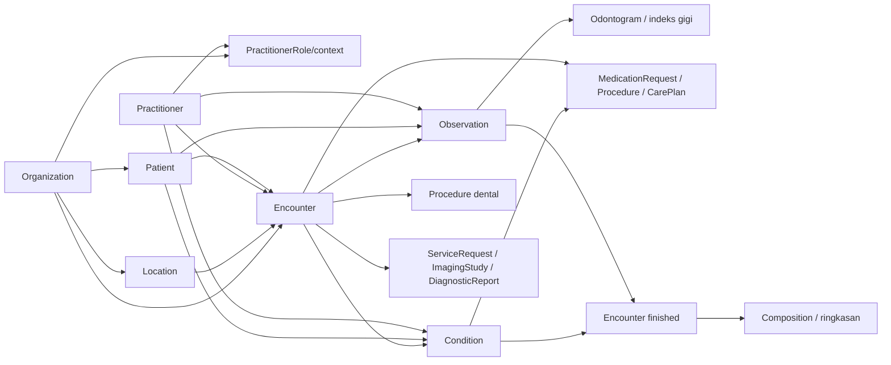
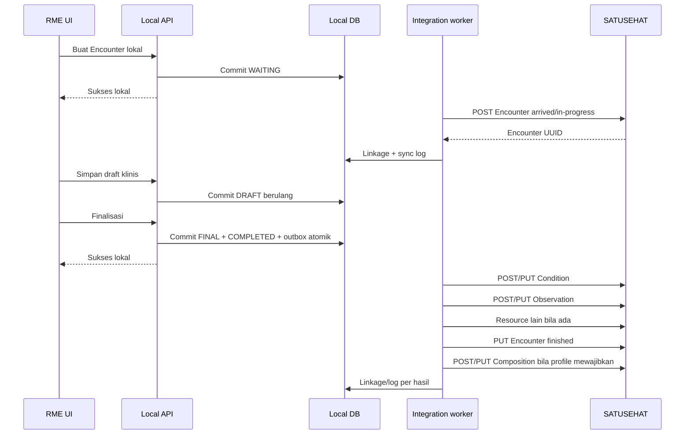

# Pemetaan Resource SATUSEHAT

## Prinsip kontrak

1. Model lokal adalah sumber kebenaran pelayanan.
2. Adapter hanya mengirim snapshot yang sudah committed.
3. Preview bukan sync dan tidak membuat status terhubung.
4. Remote create/update hanya dilakukan setelah seluruh dependency mempunyai
   `ExternalResourceLink` pada provider dan environment yang sama.
5. Setiap percobaan remote dicatat pada `SatusehatSyncLog`; hasil sukses
   menyimpan/memperbarui linkage generik.
6. Repeat sync terhadap record yang sudah linked menggunakan update dan remote
   ID yang sama, bukan create kedua.
7. Kegagalan remote tidak mengubah isi atau status transaksi klinis lokal.

## Dependency graph

Urutan delivery aktif tetap:

`Organization -> Location -> Practitioner -> Patient -> Encounter -> Condition -> Observation`

Resource setelah Observation adalah fase lanjutan dan hanya dibuat bila data
klinisnya memang ada.

Profil gigi tidak mengubah urutan delivery tersebut. Model lokal odontogram
boleh disiapkan setelah fondasi observation typed stabil, tetapi adapter remote
gigi baru diaktifkan setelah gate Encounter, Condition, dan Observation lulus.

## Matriks implementasi

| Resource | Peran dalam RME | Status codebase saat baseline | Fase |
| --- | --- | --- | --- |
| Organization | Identitas faskes | Sync/link tersedia | Prasyarat |
| Location | Unit/tempat layanan | Sync/link tersedia | Prasyarat |
| Practitioner | Tenaga kesehatan | Sync/link tersedia | Prasyarat |
| Patient | Identitas pasien | Sync/link tersedia | Prasyarat |
| Encounter | Wadah satu kunjungan rawat jalan | Local lifecycle + preview; remote belum aktif | **Berikutnya** |
| Condition | Keluhan/diagnosis sesuai profile | Model diagnosis minimal; adapter belum aktif | Setelah Encounter |
| Observation | Vital sign dan hasil pengamatan | Masih embedded; adapter belum aktif | Setelah Condition |
| Observation gigi | Odontogram, kondisi mulut, DMF/OHI-S dan indeks lain | Model/UI belum ada | Profil gigi setelah Observation inti |
| AllergyIntolerance | Alergi/intoleransi | Belum terstruktur | Lanjutan inti |
| Procedure | Tindakan yang dilakukan | Belum ada entity | Lanjutan inti |
| ImagingStudy/DiagnosticReport | Pencitraan dan hasil penunjang dental bila ada | Belum ada | Lanjutan profil gigi |
| Medication + MedicationRequest | Identitas obat dan resep | Resep masih string | Lanjutan inti |
| ServiceRequest/CarePlan | Rujukan, pemeriksaan, tindak lanjut | Belum terstruktur | Lanjutan |
| Composition | Ringkasan final yang mereferensikan resource | Belum ada | Terakhir |

## Gate per resource aktif

### Encounter

**Prasyarat remote**

- Organization linked;
- Location linked dan berada dalam organisasi yang benar;
- Patient linked;
- Practitioner linked;
- identifier kunjungan lokal unik dan period/status valid.

**Local-first behavior**

- pendaftaran membuat Encounter lokal dan antrean tanpa network call;
- perubahan status tetap memakai policy dan transaksi lokal;
- UI tetap berfungsi ketika plugin dimatikan atau SATUSEHAT offline.

**Operasi remote**

- `POST Encounter` saat belum ada linkage;
- simpan UUID dari respons sukses;
- `PUT Encounter/{remoteId}` untuk repeat sync/status berikutnya;
- payload awal memetakan rawat jalan (`AMB`) dan status arrived/in-progress;
- payload final memakai status finished, end period, diagnosis/disposition yang
  diwajibkan profile aktif, dan remote references yang sudah tersedia.

**Linkage dan log**

- satu linkage per local Encounter + provider + environment + resource type;
- create/update sukses menyimpan response metadata yang aman dan sync time;
- failure hanya menulis log gagal; tidak membuat false linkage;
- existing linkage dipertahankan sebagai koneksi terakhir ketika update terbaru
  gagal, dengan failure terbaru tetap tampak di UI/log.

**Skenario uji manual**

1. Buat Encounter baru dengan seluruh dependency linked; preview menunjukkan
   remote references yang benar.
2. Sync pertama menghasilkan create dan badge connected setelah list refresh.
3. Ubah status lokal secara sah, sync ulang, dan pastikan remote ID tidak berubah.
4. Coba Encounter dengan Patient/Location belum linked; request harus diblokir
   sebelum network call dengan pesan dependency spesifik.
5. Paksa respons remote gagal; Encounter lokal tetap utuh dan tidak muncul badge
   connected palsu.

### Condition

**Prasyarat remote**

- Patient, Encounter, dan recorder/asserter Practitioner linked;
- terminology code valid untuk profile yang dipakai;
- local diagnosis/complaint sudah committed dan memiliki stable local ID.

**Local-first behavior**

- keluhan/diagnosis dapat disimpan sebagai draft tanpa mapping remote;
- kode lokal yang belum terpetakan tetap boleh disimpan dan diberi status
  `mapping-required`; status ini tidak boleh ditampilkan sebagai tersinkron;
- finalisasi menerapkan validation profile lokal terlebih dahulu.

**Operasi remote**

- `POST Condition` bila linkage belum ada;
- `PUT Condition/{remoteId}` untuk repeat sync yang diizinkan;
- adapter membedakan category keluhan dan encounter diagnosis;
- `subject` menunjuk Patient remote, `encounter` menunjuk Encounter remote, dan
  recorder/asserter menggunakan Practitioner remote sesuai provenance lokal.

**Linkage dan log**

- linkage melekat pada stable local complaint/diagnosis ID, bukan hanya RME ID;
- satu failure tidak menghapus linkage sukses sebelumnya;
- perubahan kode setelah final mengikuti workflow amendemen sebelum dikirim.

**Skenario uji manual**

1. Sync satu diagnosis utama dan satu sekunder, lalu periksa category/rank.
2. Repeat sync mempertahankan masing-masing remote ID.
3. Code invalid atau Encounter belum linked diblokir sebelum network call.
4. Keluhan teks lokal tanpa mapping tetap tersimpan, tetapi tidak diklaim sukses.

### Observation

**Prasyarat remote**

- Patient, Encounter, dan performer Practitioner linked;
- observation mempunyai code, typed value, effective time, dan unit UCUM bila
  value berupa quantity;
- stable local observation ID tersedia.

**Local-first behavior**

- setiap vital/observation disimpan sebagai child record terstruktur;
- calculated value seperti BMI diberi provenance `derived` dan source references;
- nilai di luar rentang tidak diubah otomatis; UI meminta konfirmasi sesuai rule.

**Operasi remote**

- `POST Observation` untuk record baru;
- `PUT Observation/{remoteId}` untuk repeat sync yang diizinkan;
- `status`, `category`, LOINC, UCUM, subject, encounter, effective time, performer,
  dan value dipetakan eksplisit;
- panel/component hanya digunakan bila profile resmi mengharuskannya.

**Linkage dan log**

- linkage per stable local observation;
- batch job boleh mengirim banyak observation, tetapi hasil/link setiap item
  tetap dapat direkonsiliasi;
- partial failure tidak menandai seluruh RME sebagai sukses.

**Skenario uji manual**

1. Kirim tekanan darah, nadi, suhu, berat, dan tinggi dengan code/unit benar.
2. Pastikan decimal dan unit tidak berubah menjadi string.
3. Missing performer, invalid UCUM, atau Encounter belum linked diblokir.
4. Simulasikan satu item gagal dalam batch; item sukses tetap linked dan item
   gagal dapat di-retry secara idempotent.

### Profil gigi dan odontogram

**Prasyarat remote**

- seluruh dependency Observation umum terpenuhi;
- dental exam, tooth finding, surface finding, dan index mempunyai stable ID;
- FDI tooth, code system, component, serta terminology release lolos validator
  untuk playbook gigi aktif;
- Condition/Procedure yang direferensikan sudah committed dan mengikuti urutan
  dependency masing-masing.

**Local-first behavior**

- konsultasi gigi, odontogram, histori, dan print tetap berfungsi ketika plugin
  dinonaktifkan;
- projection odontogram terkini dibangun dari record final lokal;
- finding lokal yang belum mempunyai mapping tetap tersimpan sebagai
  `mapping-required` tanpa false sync status.

**Operasi remote**

- dental exam dapat menghasilkan beberapa `Observation`, bukan satu blob;
- FDI tooth/body site, surface, finding, restoration/prosthesis, oral finding,
  DMF, serta indeks dipetakan sesuai versi
  [playbook Rawat Jalan Gigi](https://satusehat.kemkes.go.id/platform/docs/id/interoperability/rawat-jalan-gigi/) aktif;
- diagnosis menggunakan `Condition`, tindakan `Procedure`, sedangkan order dan
  hasil penunjang memakai `ServiceRequest`, `ImagingStudy`, atau
  `DiagnosticReport` hanya jika kejadian tersebut ada;
- create/update dan linkage dilakukan per stable local record agar partial
  failure dapat direkonsiliasi.

**Skenario uji manual**

1. Kirim satu temuan gigi permanen dengan surface dan satu oral finding.
2. Kirim satu odontogram dentisi sulung; pastikan FDI tidak tertukar.
3. Kirim index dengan component, method, performer, dan effective time.
4. Repeat sync mempertahankan remote ID setiap item.
5. Satu code/component invalid diblokir tanpa menggagalkan item lokal lain.

## Urutan kejadian satu kunjungan

## Aturan payload dan versioning

- Simpan versi playbook, FHIR profile, terminology release, dan mapper version
  pada metadata job/log agar payload historis dapat dijelaskan.
- Gunakan contoh Postman untuk contract test, lalu normalisasi data contoh agar
  tidak masuk seed klinis produksi.
- Jangan memasukkan field hanya untuk menyerupai contoh bila data lokal tidak
  ada atau use case tidak berlaku.
- Jangan menyimpan access token, secret, NIK lengkap, atau narasi klinis mentah
  di sync log.
- Search/import remote adalah operasi eksplisit dan tidak mengganti source of
  truth lokal tanpa review pengguna.

## Definition of done adapter baru

- feature flag dan capability descriptor tersedia;
- adapter tidak diimpor core domain;
- dependency preflight diuji;
- create dan repeat update idempotent diuji;
- linkage sukses dan failure handling memiliki unit/integration test;
- list/detail menampilkan action sync, status, logo, dan copy remote ID dari
  linkage persisten;
- loading, disabled reason, error, retry, dan stale linkage state tertangani;
- satu sandbox create dan satu repeat sync diverifikasi manual;
- provider dapat dimatikan dan alur lokal tetap build/start/berfungsi.
