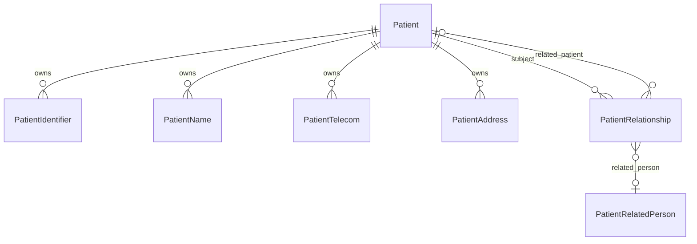

# Model Data Patient Terstruktur (PRI-31)

Dokumen ini menetapkan model domain lokal untuk identitas dan demografi pasien.
Struktur ini platform-agnostic. Kontrak pertukaran eksternal hanya boleh membaca
model ini melalui mapper; entity inti tidak menyimpan payload atau nama
platform eksternal baru.

## ERD dan ownership

`Patient` memiliki child identity/demographic dan menjadi aggregate root untuk
create. Child dihapus secara cascade hanya bila Patient dihapus. Target relasi
Patient atau PatientRelatedPerson memakai `RESTRICT` agar relasi historis tidak
diam-diam hilang. Satu PatientRelationship wajib menunjuk tepat satu target.
Record bayi selalu merupakan Patient terpisah dari ibu atau wali.

`Patient.id` dan `medicalRecNo` adalah identifier lokal immutable.
`medicalRecNo` tetap dialokasikan dengan PostgreSQL sequence. NIK, NIK ibu,
paspor, kartu keluarga, dan identifier lain berada di PatientIdentifier dengan
namespace dan aturan masing-masing.

## Matrix kewajiban

| Entity/field                                                   | Kategori                     | Aturan                                                    |
| -------------------------------------------------------------- | ---------------------------- | --------------------------------------------------------- |
| Patient.id, medicalRecNo                                       | Core required                | Immutable dan unik lokal                                  |
| Patient.fullName, birthDate, gender                            | Core required                | Tetap menjadi contract legacy selama compatibility window |
| Patient.active, version                                        | Core required                | Default aktif dan version positif                         |
| birthPlaceText, deceasedAt, maritalStatusCode, citizenshipCode | Optional                     | Diisi bila diketahui/use case memerlukan                  |
| multipleBirthOrder                                             | Conditional                  | Bilangan positif untuk kelahiran kembar                   |
| PatientIdentifier.type/system/value/normalizedValue            | Core required per identifier | Namespace tidak boleh diasumsikan dari value              |
| identifier verificationStatus/isPrimary/active                 | Core required per identifier | Maksimal satu primary aktif per type                      |
| identifier issuer/validFrom/validTo                            | Optional                     | Period valid bila akhir tidak sebelum awal                |
| PatientName.use/text                                           | Core required per nama       | OFFICIAL, PREFERRED, ALIAS, atau OLD; family opsional     |
| name given/family/prefix/suffix/period                         | Optional                     | Tidak memaksa family name                                 |
| PatientTelecom system/value/normalizedValue/use/rank           | Core required per telecom    | Rank positif; normalisasi mengikuti system                |
| telecom verification/active/period                             | Core/optional                | Status dan active wajib; period opsional                  |
| PatientAddress use/type                                        | Core required per alamat     | HOME, WORK, TEMP, OLD, OTHER                              |
| address text atau lines                                        | Conditional                  | Minimal salah satu tersedia; text hanya display           |
| postal/country/administrative-area code+name                   | Optional                     | Provinsi sampai desa/kelurahan disimpan terpisah          |
| PatientRelationship relationshipCode/target/active             | Core required per relasi     | Tepat satu relatedPatient atau relatedPerson              |
| relationship period/guardian/contactPriority                   | Optional/conditional         | Guardian eksplisit; priority positif                      |

## Normalization dan constraint

- NIK dan NIK ibu menerima separator spasi, titik, atau tanda hubung pada API,
  lalu disimpan sebagai tepat 16 digit.
- Identifier non-NIK dinormalisasi sebagai teks uppercase dan tidak menjalani
  validator panjang NIK.
- Partial unique index
  `PatientIdentifier_active_nik_national_key` menjamin satu NIK aktif hanya
  dimiliki satu Patient, tanpa memblokir pasien tanpa NIK.
- Partial unique index `PatientIdentifier_active_nik_per_patient_key`
  mencegah dua NIK aktif pada Patient yang sama.
- Partial unique index
  `PatientIdentifier_active_primary_per_type_key` membatasi satu primary aktif
  per jenis identifier.
- Telepon dibersihkan dari separator, email dilowercase, dan nilai display tetap
  dipertahankan terpisah dari normalizedValue.
- Period pada identifier, nama, telecom, alamat, dan relasi menolak akhir yang
  lebih awal dari awal.
- PatientRelationship menolak target ganda, target kosong, dan self-reference.

## Compatibility dan backfill

Migration `20260731140000_structured_patient_demographics` bersifat additive.
Kolom `nik`, `fullName`, `phone`, `address`, dan `satusehatId` tidak dihapus dari
database. Kolom legacy `satusehatId` tidak lagi dibaca atau ditulis oleh domain
Patient; linkage provider disajikan melalui `integrations` dan disimpan di
`ExternalResourceLink` oleh plugin integrasi.

Backfill memetakan:

| Kolom legacy | Target baru                                                         |
| ------------ | ------------------------------------------------------------------- |
| nik          | NIK aktif, primary, namespace `urn:id:nik`                          |
| fullName     | PatientName OFFICIAL                                                |
| phone        | PatientTelecom PHONE/MOBILE rank 1                                  |
| address      | PatientAddress HOME/PHYSICAL; hanya `text`, tanpa parsing heuristik |

Create API menulis row Patient legacy dan semua child record sebagai satu nested
Prisma write yang atomik. Input legacy otomatis menghasilkan child record.
Input terstruktur tetap mengisi kolom legacy NIK bila terdapat NIK aktif, dan
menolak nilai legacy/structured yang tidak konsisten. Response memakai kontrak
core terbaru dengan array terstruktur dan `integrations`; `satusehatId` bukan
lagi field response Patient.

Rollback aplikasi dapat kembali membaca kolom legacy karena kolom tersebut
tidak dihapus. Rollback database dilakukan dengan migration baru yang lebih
dulu menghentikan structured writes, memverifikasi parity legacy, menghapus FK
dan child table, lalu enum/kolom PRI-31. Migration yang sudah diterapkan tidak
boleh diedit atau di-revert in-place.

## Privacy, audit, index, dan retention

- `value` adalah nilai display PII; `normalizedValue` khusus exact lookup dan
  tidak boleh dikirim ke log aplikasi. Endpoint harus mengikuti permission
  `patient.read`/`patient.write`; tidak ada perubahan role pada PRI-31.
- Redaction pada observability: NIK hanya boleh tampil empat digit terakhir,
  telepon/email dimasking, dan alamat tidak dicatat dalam log request.
- Encryption-at-rest/column encryption untuk identifier dan kontak adalah
  hardening lanjutan. Partial uniqueness saat ini membutuhkan normalized lookup
  value; bila dienkripsi, gunakan deterministic keyed lookup token terpisah.
- `createdAt`/`updatedAt`, active, verification, dan period menyediakan audit
  dasar serta histori. Audit event append-only/actor field penuh berada di
  issue audit terpisah dan tidak boleh digantikan dengan overwrite child lama.
- Index disediakan untuk patient/type, normalized identifier, telecom lookup,
  address region, dan arah relasi. Query PII harus tetap dibatasi izin server.
- Identifier/nama/alamat/relasi historis dipertahankan dengan `active=false`
  atau `validTo`; retention mengikuti kebijakan rekam medis organisasi. Data
  historis tidak dihapus hanya karena bukan lagi nilai utama.

## Fixture dan batas scope

Seed mencakup pasien ber-NIK, pasien tanpa NIK dengan paspor, bayi dengan NIK
ibu, alias/nama lama/preferred name, multi-telecom, multi-address, relasi
ibu-bayi, serta wali non-Patient.

PRI-31 tidak melakukan network call, lookup MPI/IHS, patient merge, perubahan
UI pencarian/registrasi, perubahan permission, atau migrasi `satusehatId`.
